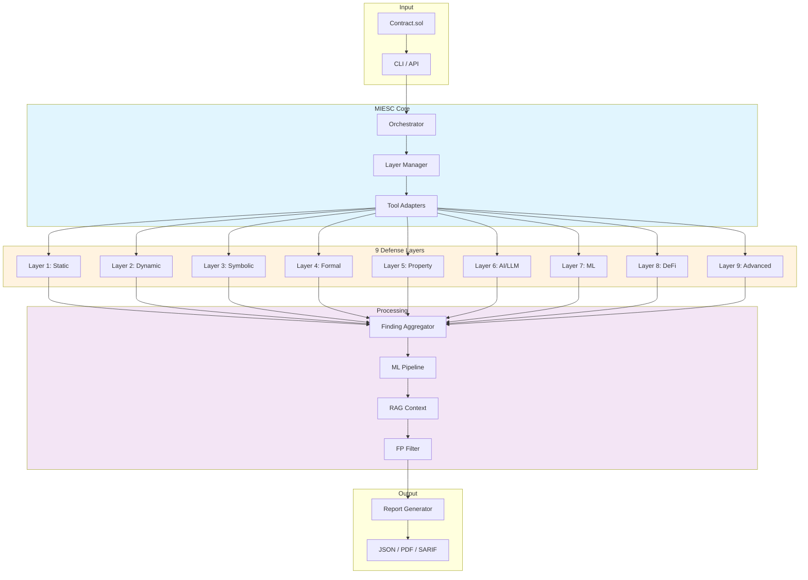
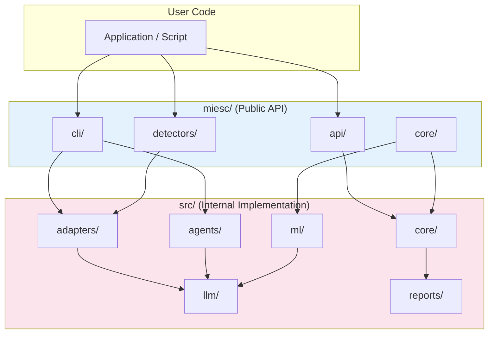
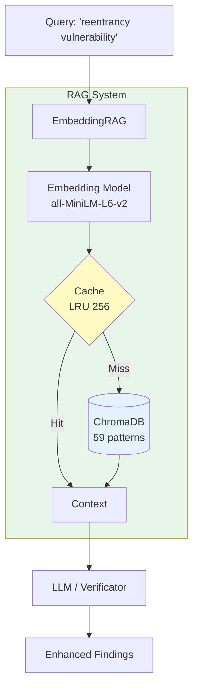

# MIESC Architecture

This document describes the architecture of MIESC and the relationship between its packages.

---

## High-Level Architecture



---

## Package Structure Overview

MIESC uses a dual-package structure to maintain backward compatibility while providing a clean public API:

```
MIESC/
├── miesc/                  # Public API package (installed via pip)
│   ├── __init__.py        # Version and top-level exports
│   ├── cli/               # Command-line interface
│   │   ├── main.py        # CLI entry point
│   │   └── commands/      # 15 command modules
│   ├── api/               # Python API
│   ├── detectors/         # Custom detector API
│   ├── core/              # Core abstractions
│   └── mcp/               # MCP protocol support
│
├── src/                    # Internal implementation
│   ├── adapters/          # 50 tool adapters
│   ├── agents/            # Analysis agents
│   ├── core/              # Core framework
│   ├── detectors/         # Built-in detectors
│   ├── llm/               # LLM integration
│   ├── ml/                # ML pipeline
│   ├── mcp_core/          # MCP implementation
│   └── reports/           # Report generation
│
└── config/                 # Configuration files
    └── miesc.yaml         # Central configuration
```

---

## Package Relationships

### miesc/ - Public API

The `miesc/` package is the **public API** that users import:

```python
# User-facing imports
from miesc.api import run_tool, run_full_audit
from miesc.detectors import BaseDetector, Finding, Severity
```

This package:
- Provides stable, documented APIs
- Re-exports from `src/` for backward compatibility
- Is installed when users run `pip install miesc`

### src/ - Internal Implementation

The `src/` package contains the **internal implementation**:

- Tool adapters (`src/adapters/`)
- Core framework (`src/core/`)
- Analysis agents (`src/agents/`)
- Report generation (`src/reports/`)

This package:
- Contains the actual implementation code
- May change between versions without notice
- Should not be imported directly by external users

### Relationship Diagram



**ASCII Fallback:**

```
┌─────────────────────────────────────────────────────────────┐
│                      User Code                              │
└─────────────────────────────────────────────────────────────┘
                              │
                              ▼
┌─────────────────────────────────────────────────────────────┐
│                   miesc/ (Public API)                       │
│  ┌─────────┐  ┌─────────┐  ┌───────────┐  ┌─────────────┐  │
│  │   cli   │  │   api   │  │ detectors │  │    core     │  │
│  └────┬────┘  └────┬────┘  └─────┬─────┘  └──────┬──────┘  │
└───────┼────────────┼─────────────┼───────────────┼──────────┘
        │            │             │               │
        ▼            ▼             ▼               ▼
┌─────────────────────────────────────────────────────────────┐
│                src/ (Internal Implementation)               │
│  ┌──────────┐  ┌────────┐  ┌────────┐  ┌────────┐          │
│  │ adapters │  │ agents │  │  core  │  │   ml   │   ...    │
│  └──────────┘  └────────┘  └────────┘  └────────┘          │
└─────────────────────────────────────────────────────────────┘
```

---

## 9-Layer Defense Architecture

MIESC implements a 9-layer security analysis architecture:


| Layer | Name | Tools | Purpose |
|-------|------|-------|---------|
| 1 | Static Analysis | Slither, Aderyn, Solhint | Code patterns, linting |
| 2 | Dynamic Testing | Echidna, Foundry, Medusa | Fuzzing, property testing |
| 3 | Symbolic Execution | Mythril, Halmos | Path exploration |
| 4 | Formal Verification | Certora, SMTChecker | Mathematical proofs |
| 5 | Property Testing | PropertyGPT, Wake, Vertigo | Mutation testing |
| 6 | AI/LLM Analysis | SmartLLM, GPTScan | LLM-based detection |
| 7 | Pattern Recognition | DA-GNN, SmartGuard | ML-based patterns |
| 8 | DeFi Security | MEV Detector, DeFi Analyzer | Protocol-specific |
| 9 | Advanced Detection | Threat Model, SmartBugs | Ensemble analysis |

---

## Plugin System

### Creating Custom Detectors

Users can create custom detectors by extending `BaseDetector`:

```python
from miesc.detectors import BaseDetector, Finding, Severity, Location

class MyDetector(BaseDetector):
    name = "my-detector"
    description = "Detects my custom pattern"
    category = "custom"

    def analyze(self, source_code: str, file_path: str = None) -> list[Finding]:
        findings = []
        if "dangerous_pattern" in source_code:
            findings.append(Finding(
                detector=self.name,
                title="Dangerous Pattern Found",
                description="The code contains a dangerous pattern",
                severity=Severity.HIGH,
                location=Location(file=file_path or "", line=1),
                recommendation="Remove the dangerous pattern"
            ))
        return findings
```

### Registering Detectors

Register via entry points in `pyproject.toml`:

```toml
[project.entry-points."miesc.detectors"]
my-detector = "my_package.detectors:MyDetector"
```

Or programmatically:

```python
from miesc.detectors import register_detector
register_detector(MyDetector)
```

### Plugin Discovery

MIESC discovers plugins from:
1. Entry points (`miesc.detectors` namespace)
2. Local plugins directory (`~/.miesc/plugins/`)
3. Project plugins (`./miesc_plugins/`)

---

## CLI Architecture

The CLI is built with Click and organized into command modules:

```
miesc/cli/
├── main.py              # CLI entry point (126 lines)
└── commands/            # 15 command modules
    ├── scan.py          # miesc scan
    ├── audit.py         # miesc audit
    ├── report.py        # miesc report
    ├── export.py        # miesc export
    ├── doctor.py        # miesc doctor
    ├── version.py       # miesc version
    ├── config.py        # miesc config
    ├── server.py        # miesc server
    ├── benchmark.py     # miesc benchmark
    ├── watch.py         # miesc watch
    ├── detectors.py     # miesc detectors
    ├── plugins.py       # miesc plugins
    ├── mcp.py           # miesc mcp
    ├── init.py          # miesc init
    └── web.py           # miesc web
```

---

## Data Flow

### Audit Flow

```
Contract.sol
     │
     ▼
┌─────────────────┐
│  CLI/API Call   │
└────────┬────────┘
         │
         ▼
┌─────────────────┐
│  Orchestrator   │◄──── Config (miesc.yaml)
└────────┬────────┘
         │
    ┌────┴────┐
    ▼         ▼
┌───────┐ ┌───────┐
│Layer 1│ │Layer 2│ ... Layer 9
└───┬───┘ └───┬───┘
    │         │
    └────┬────┘
         ▼
┌─────────────────┐
│   ML Pipeline   │◄──── RAG Context
│  (FP Filter)    │
└────────┬────────┘
         │
         ▼
┌─────────────────┐
│ Report Generator│
└────────┬────────┘
         │
         ▼
    results.json
```

### RAG Integration



**Performance:**
- O(1) document lookup with caching
- 5-minute TTL, 256-entry LRU cache
- 50-75% faster verificator stage with batch search

**ASCII Fallback:**

```
Query: "reentrancy vulnerability"
         │
         ▼
┌─────────────────────────┐
│   EmbeddingRAG          │
│   (ChromaDB + MiniLM)   │
└────────────┬────────────┘
             │
    ┌────────┴────────┐
    │                 │
    ▼                 ▼
┌────────┐     ┌─────────────┐
│ Cache  │     │ Vector DB   │
│ (LRU)  │     │ (59 patterns)│
└───┬────┘     └──────┬──────┘
    │                 │
    └────────┬────────┘
             │
             ▼
    Context for LLM/Verificator
```

---

## Configuration

### Central Configuration

All settings in `config/miesc.yaml`:

```yaml
# General settings
general:
  default_solc_version: "0.8.19"
  timeout: 300
  parallel_tools: 4

# Layer configuration
layers:
  static:
    tools: [slither, aderyn, solhint]
    timeout: 60
  symbolic:
    tools: [mythril, halmos]
    timeout: 300

# LLM settings
llm:
  provider: ollama
  model: mistral:latest
  timeout: 120
```

### Environment Variables

| Variable | Purpose |
|----------|---------|
| `OLLAMA_HOST` | Ollama server URL |
| `MIESC_CONFIG` | Custom config path |
| `MIESC_CACHE_DIR` | Cache directory |
| `MIESC_LOG_LEVEL` | Logging level |

---

## Contributing to Architecture

See [CONTRIBUTING.md](../CONTRIBUTING.md) for guidelines on:
- Adding new adapters
- Creating custom detectors
- Extending the CLI
- Adding new layers

---

*Last updated: February 2026*
