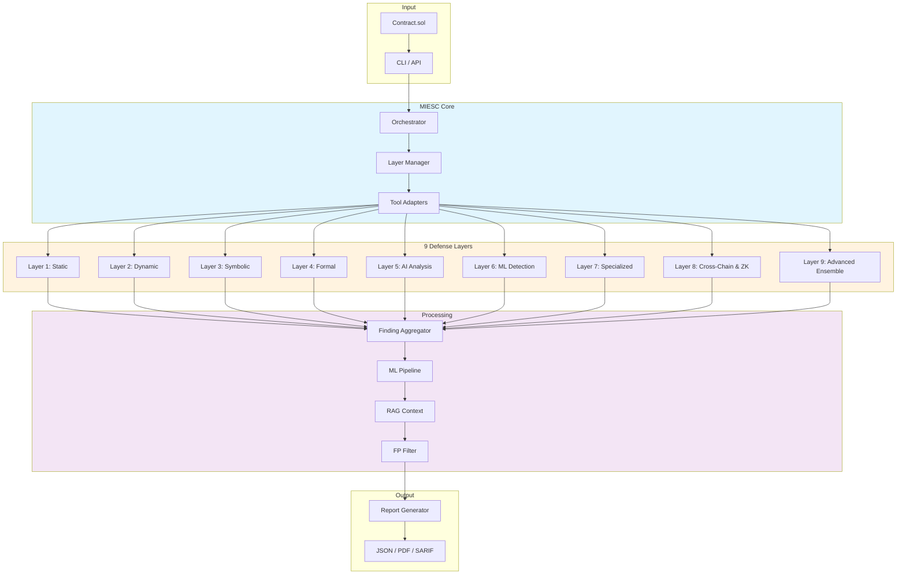
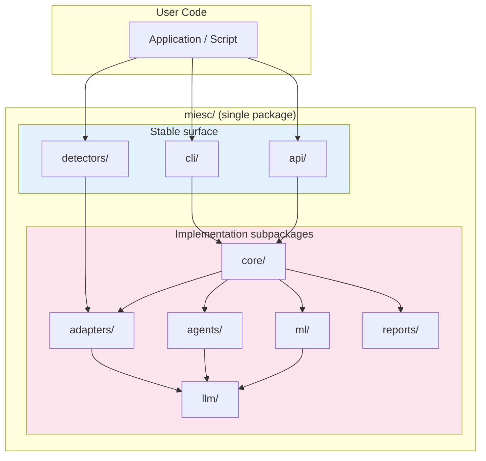
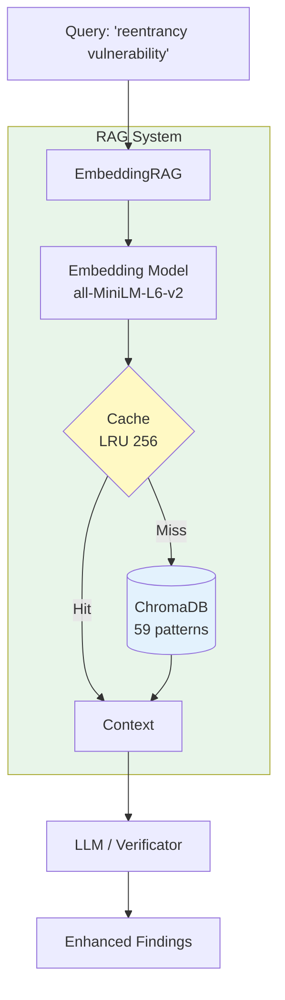

# MIESC Architecture

This document describes the architecture of MIESC and the relationship between its packages.

---

## High-Level Architecture


```mermaid
flowchart TB
    subgraph Input
        A[Contract.sol] --> B[CLI / API]
    end

    subgraph Core["MIESC Core"]
        B --> C[Orchestrator]
        C --> D[Layer Manager]
        D --> E[Tool Adapters]
    end

    subgraph Layers["9 Defense Layers"]
        E --> L1[Layer 1: Static]
        E --> L2[Layer 2: Dynamic]
        E --> L3[Layer 3: Symbolic]
        E --> L4[Layer 4: Formal]
        E --> L5[Layer 5: AI Analysis]
        E --> L6[Layer 6: ML Detection]
        E --> L7[Layer 7: Specialized]
        E --> L8[Layer 8: Cross-Chain & ZK]
        E --> L9[Layer 9: Advanced Ensemble]
    end

    subgraph Processing
        L1 & L2 & L3 & L4 & L5 & L6 & L7 & L8 & L9 --> F[Finding Aggregator]
        F --> G[ML Pipeline]
        G --> H[RAG Context]
        H --> I[FP Filter]
    end

    subgraph Output
        I --> J[Report Generator]
        J --> K[JSON / PDF / SARIF]
    end

    style Core fill:#e1f5fe
    style Layers fill:#fff3e0
    style Processing fill:#f3e5f5
```

---

## Package Structure Overview

As of v6.0.0, MIESC ships as a **single `miesc/` package**. Everything —
public API, CLI, tool adapters, agents, ML pipeline, and report generation —
lives under one import root. (Earlier releases split the code into a public
`miesc/` façade and an internal `src/` implementation package; that split was
removed in the v6.0.0 unification. See
[ADR-0004](adr/0004-dual-package-structure.md), now superseded.)

```
MIESC/
├── miesc/                  # The whole package (installed via pip)
│   ├── __init__.py        # Version and top-level exports
│   ├── cli/               # Command-line interface (Click) + commands/
│   ├── api/               # Python API + local REST API (rest.py)
│   ├── core/              # Core abstractions: agent protocol/registry,
│   │                      #   baseline, code actions, chain abstraction
│   ├── adapters/          # Tool adapters (Slither, Mythril, Echidna, …)
│   ├── agents/            # Analysis agents (agentic auditor, tool agents)
│   ├── detectors/         # Built-in + custom detector API (BaseDetector)
│   ├── llm/               # LLM integration, RAG, ensemble, orchestrator
│   ├── ml/                # ML pipeline (FP filter, embeddings, call graph)
│   ├── formal/            # Formal specs + unified report
│   ├── lsp/               # Language Server Protocol server + diagnostics
│   ├── mcp/ + mcp_core/   # MCP protocol support and implementation
│   ├── reports/           # Report generation (audit, risk, LLM interpret)
│   ├── security/          # AI-security hardening, compliance, remediations
│   ├── knowledge_base/    # Vulnerability pattern knowledge base
│   ├── plugins/           # Plugin discovery and loading
│   ├── evaluation/ …      # Benchmarking, integration, cache, utils, data
│   └── …
│
└── config/                 # Configuration files
    └── miesc.yaml         # Central configuration
```

---

## Package Relationships

### One package, subpackages by concern

There is no longer a "public API vs. internal implementation" package
boundary. `miesc/` is the entire codebase, organized into subpackages by
concern. Users install `miesc` and import directly from it:

```python
# User-facing imports
from miesc.api import run_tool, run_full_audit
from miesc.detectors import BaseDetector, Finding, Severity
```

The stable, documented surface for external users is `miesc.api`,
`miesc.detectors`, and the CLI. The remaining subpackages (`adapters`,
`agents`, `core`, `llm`, `ml`, `reports`, …) are the implementation: importable,
but not part of the compatibility contract and may change between versions.

Top-level `__init__.py` still uses lazy `__getattr__` loading so that importing
`miesc` (or invoking the CLI) does not eagerly pull in all 50+ adapters and the
ML stack — startup stays fast even though everything lives in one package.

### Relationship Diagram


```mermaid
flowchart TB
    subgraph UserCode["User Code"]
        UC[Application / Script]
    end

    subgraph Package["miesc/ (single package)"]
        subgraph Surface["Stable surface"]
            CLI[cli/]
            API[api/]
            DET[detectors/]
        end
        subgraph Impl["Implementation subpackages"]
            CORE[core/]
            ADAP[adapters/]
            AGEN[agents/]
            ML[ml/]
            LLM[llm/]
            REP[reports/]
        end
    end

    UC --> CLI
    UC --> API
    UC --> DET

    CLI --> CORE
    API --> CORE
    DET --> ADAP
    CORE --> ADAP
    CORE --> AGEN
    CORE --> ML

    ADAP --> LLM
    AGEN --> LLM
    ML --> LLM
    CORE --> REP

    style Surface fill:#e3f2fd
    style Impl fill:#fce4ec
```

**ASCII Fallback:**

```
┌─────────────────────────────────────────────────────────────┐
│                      User Code                              │
└─────────────────────────────────────────────────────────────┘
                              │
                              ▼
┌─────────────────────────────────────────────────────────────┐
│                 miesc/ (single package)                     │
│  Stable surface:                                            │
│  ┌─────────┐  ┌─────────┐  ┌───────────┐                    │
│  │   cli   │  │   api   │  │ detectors │                    │
│  └────┬────┘  └────┬────┘  └─────┬─────┘                    │
│       │            │             │                          │
│       ▼            ▼             ▼                          │
│  Implementation subpackages:                                │
│  ┌──────┐ ┌──────────┐ ┌────────┐ ┌──────┐ ┌─────┐          │
│  │ core │ │ adapters │ │ agents │ │  ml  │ │ llm │  ...     │
│  └──────┘ └──────────┘ └────────┘ └──────┘ └─────┘          │
└─────────────────────────────────────────────────────────────┘
```

---

## 9-Layer Defense Architecture

MIESC implements a 9-layer security analysis architecture:


```mermaid
graph LR
    subgraph Layer1["Layer 1: Static Analysis"]
        S1[Slither]
        S2[Aderyn]
        S3[Solhint]
    end

    subgraph Layer2["Layer 2: Dynamic Testing"]
        D1[Echidna]
        D2[Foundry]
        D3[Medusa]
    end

    subgraph Layer3["Layer 3: Symbolic Execution"]
        SY1[Mythril]
        SY2[Halmos]
    end

    subgraph Layer4["Layer 4: Formal Verification"]
        F1[Certora]
        F2[SMTChecker]
    end

    subgraph Layer5["Layer 5: AI Analysis"]
        P1[SmartLLM]
        P2[GPTScan]
        P3[LLMSmartAudit]
    end

    subgraph Layer6["Layer 6: ML Detection"]
        A1[DA-GNN]
        A2[SmartBugs-ML]
        A3[SmartGuard]
    end

    subgraph Layer7["Layer 7: Specialized Analysis"]
        M1[Threat Model]
        M2[Gas Analyzer]
        M3[MEV Detector]
    end

    subgraph Layer8["Layer 8: Cross-Chain & ZK Security"]
        DF1[Cross-Chain]
        DF2[ZK Circuit]
        DF3[Bridge Monitor]
    end

    subgraph Layer9["Layer 9: Advanced AI Ensemble"]
        AD1[LLMBugScanner]
        AD2[Audit Consensus]
        AD3[Exploit Synthesizer]
    end

    Contract[Contract.sol] --> Layer1
    Layer1 --> Layer2
    Layer2 --> Layer3
    Layer3 --> Layer4
    Layer4 --> Layer5
    Layer5 --> Layer6
    Layer6 --> Layer7
    Layer7 --> Layer8
    Layer8 --> Layer9
    Layer9 --> Results[Aggregated Findings]

    style Layer1 fill:#c8e6c9
    style Layer2 fill:#bbdefb
    style Layer3 fill:#d1c4e9
    style Layer4 fill:#ffe0b2
    style Layer5 fill:#f8bbd9
    style Layer6 fill:#b2ebf2
    style Layer7 fill:#dcedc8
    style Layer8 fill:#ffccbc
    style Layer9 fill:#cfd8dc
```

| Layer | Name | Tools | Purpose |
|-------|------|-------|---------|
| 1 | Static Analysis | Slither, Aderyn, Solhint | Code patterns, linting |
| 2 | Dynamic Testing | Echidna, Foundry, Medusa | Fuzzing, property testing |
| 3 | Symbolic Execution | Mythril, Halmos | Path exploration |
| 4 | Formal Verification | Certora, SMTChecker | Mathematical proofs |
| 5 | AI Analysis | SmartLLM, GPTScan, LLMSmartAudit, GPTLens, LlamaAudit, iAudit | LLM-based detection |
| 6 | ML Detection | DA-GNN, SmartBugs-ML, SmartBugs-Detector, SmartGuard, Peculiar | ML-based classification |
| 7 | Specialized Analysis | Threat Model, Gas Analyzer, MEV Detector, Clone Detector, DeFi, Advanced Detector, Upgradability Checker | Domain-specific checks |
| 8 | Cross-Chain & ZK Security | Cross-Chain, ZK Circuit, Bridge Monitor, L2 Validator, Circom Analyzer | Bridge & ZK circuit analysis |
| 9 | Advanced AI Ensemble | LLMBugScanner, Audit Consensus, Exploit Synthesizer, Vuln Verifier, Remediation Validator | Multi-LLM consensus |

> Layers 8–9 (Cross-Chain & ZK Security, Advanced AI Ensemble) are experimental modules on the multi-chain roadmap; the EVM core is Layers 1–7.

---

## Plugin System

### Creating Custom Detectors

Users can create custom detectors by extending `BaseDetector`:

```python
from miesc.detectors import BaseDetector, Finding, Severity, Location

class MyDetector(BaseDetector):
    name = "my-detector"
    description = "Detects my custom pattern"
    category = "custom"

    def analyze(self, source_code: str, file_path: str = None) -> list[Finding]:
        findings = []
        if "dangerous_pattern" in source_code:
            findings.append(Finding(
                detector=self.name,
                title="Dangerous Pattern Found",
                description="The code contains a dangerous pattern",
                severity=Severity.HIGH,
                location=Location(file=file_path or "", line=1),
                recommendation="Remove the dangerous pattern"
            ))
        return findings
```

### Registering Detectors

Register via entry points in `pyproject.toml`:

```toml
[project.entry-points."miesc.detectors"]
my-detector = "my_package.detectors:MyDetector"
```

Or programmatically:

```python
from miesc.detectors import register_detector
register_detector(MyDetector)
```

### Plugin Discovery

MIESC discovers plugins from:
1. Entry points (`miesc.detectors` namespace)
2. Local plugins directory (`~/.miesc/plugins/`)
3. Project plugins (`./miesc_plugins/`)

---

## CLI Architecture

The CLI is built with Click and organized into per-command modules:

```
miesc/cli/
├── main.py              # CLI entry point (thin dispatcher)
└── commands/            # one module per command
    ├── scan.py          # miesc scan
    ├── analyze.py       # miesc analyze
    ├── audit.py         # miesc audit
    ├── detect.py        # miesc detect
    ├── report.py        # miesc report
    ├── export.py        # miesc export
    ├── remediate.py     # miesc remediate
    ├── fix.py           # miesc fix
    ├── baseline.py      # miesc baseline
    ├── verify.py        # miesc verify
    ├── specs.py         # miesc specs (formal)
    ├── testgen.py       # miesc testgen
    ├── poc.py           # miesc poc
    ├── evaluate.py      # miesc evaluate
    ├── benchmark.py     # miesc benchmark
    ├── compliance.py    # miesc compliance
    ├── config.py        # miesc config
    ├── init.py          # miesc init
    ├── doctor.py        # miesc doctor
    ├── tools.py         # miesc tools
    ├── detectors.py     # miesc detectors
    ├── plugins.py       # miesc plugins
    ├── server.py        # miesc server (REST API)
    ├── lsp.py           # miesc lsp (Language Server)
    └── watch.py         # miesc watch
```

---

## Data Flow

### Audit Flow

```
Contract.sol
     │
     ▼
┌─────────────────┐
│  CLI/API Call   │
└────────┬────────┘
         │
         ▼
┌─────────────────┐
│  Orchestrator   │◄──── Config (miesc.yaml)
└────────┬────────┘
         │
    ┌────┴────┐
    ▼         ▼
┌───────┐ ┌───────┐
│Layer 1│ │Layer 2│ ... Layer 9
└───┬───┘ └───┬───┘
    │         │
    └────┬────┘
         ▼
┌─────────────────┐
│   ML Pipeline   │◄──── RAG Context
│  (FP Filter)    │
└────────┬────────┘
         │
         ▼
┌─────────────────┐
│ Report Generator│
└────────┬────────┘
         │
         ▼
    results.json
```

### RAG Integration


```mermaid
flowchart TB
    Q["Query: 'reentrancy vulnerability'"] --> ER[EmbeddingRAG]

    subgraph RAG["RAG System"]
        ER --> EMB[Embedding Model<br/>all-MiniLM-L6-v2]
        EMB --> CACHE{Cache<br/>LRU 256}
        CACHE -->|Hit| CTX[Context]
        CACHE -->|Miss| VDB[(ChromaDB<br/>59 patterns)]
        VDB --> CTX
    end

    CTX --> LLM[LLM / Verificator]
    LLM --> FIND[Enhanced Findings]

    style RAG fill:#e8f5e9
    style CACHE fill:#fff9c4
    style VDB fill:#e3f2fd
```

**Performance:**
- O(1) document lookup with caching
- 5-minute TTL, 256-entry LRU cache
- 50-75% faster verificator stage with batch search

**ASCII Fallback:**

```
Query: "reentrancy vulnerability"
         │
         ▼
┌─────────────────────────┐
│   EmbeddingRAG          │
│   (ChromaDB + MiniLM)   │
└────────────┬────────────┘
             │
    ┌────────┴────────┐
    │                 │
    ▼                 ▼
┌────────┐     ┌─────────────┐
│ Cache  │     │ Vector DB   │
│ (LRU)  │     │ (59 patterns)│
└───┬────┘     └──────┬──────┘
    │                 │
    └────────┬────────┘
             │
             ▼
    Context for LLM/Verificator
```

---

## Configuration

### Central Configuration

All settings in `config/miesc.yaml`:

```yaml
# General settings
general:
  default_solc_version: "0.8.19"
  timeout: 300
  parallel_tools: 4

# Layer configuration
layers:
  static:
    tools: [slither, aderyn, solhint]
    timeout: 60
  symbolic:
    tools: [mythril, halmos]
    timeout: 300

# LLM settings
llm:
  provider: ollama
  model: mistral:latest
  timeout: 120
```

### Environment Variables

| Variable | Purpose |
|----------|---------|
| `OLLAMA_HOST` | Ollama server URL |
| `MIESC_CONFIG` | Custom config path |
| `MIESC_CACHE_DIR` | Cache directory |
| `MIESC_LOG_LEVEL` | Logging level |

---

## Contributing to Architecture

See [CONTRIBUTING.md](CONTRIBUTING.md) for guidelines on:
- Adding new adapters
- Creating custom detectors
- Extending the CLI
- Adding new layers

---

*Last updated: July 2026 (v6.0.0 single-package unification)*
