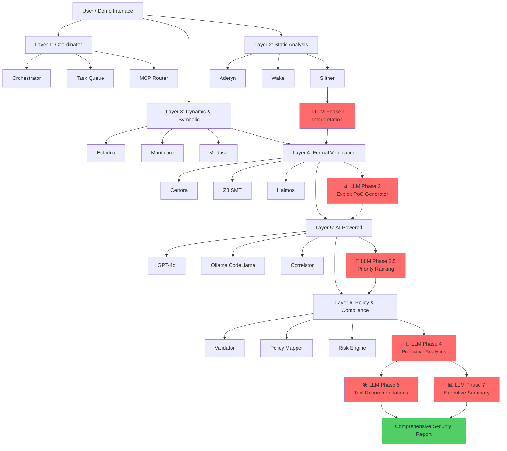

# MIESC LLM Integration Visual Diagrams

**Purpose:** Visual representations of the 6 LLM integration points in the hacker demo
**Format:** ASCII art (terminal-compatible) + Mermaid (for documentation sites)
**Author:** Fernando Boiero - UNDEF, IUA Córdoba

---

## Diagram 1: Complete System Architecture with LLM Layers

### ASCII Version (Terminal Display)

```
╔═══════════════════════════════════════════════════════════════════════════════╗
║                    MIESC v3.3 - LLM-Enhanced Architecture                     ║
║                   Multi-Agent Smart Contract Security Platform                ║
╚═══════════════════════════════════════════════════════════════════════════════╝

                            ┌─────────────────┐
                            │  User / Demo    │
                            │   Interface     │
                            └────────┬────────┘
                                     │
         ┌───────────────────────────┼──────────────────────────┐
         │                           │                          │
         ▼                           ▼                          ▼
┌────────────────┐          ┌────────────────┐        ┌────────────────┐
│ LAYER 1        │          │ LAYER 2        │        │ LAYER 3        │
│ Coordinator    │          │ Static         │        │ Dynamic &      │
│                │          │ Analysis       │        │ Symbolic       │
│ • Orchestrator │──────────│ • Slither      │────────│ • Echidna      │
│ • Task Queue   │          │ • Aderyn       │        │ • Manticore    │
│ • MCP Router   │          │ • Wake         │        │ • Medusa       │
└────────┬───────┘          └────────┬───────┘        └────────┬───────┘
         │                           │                          │
         │                           ▼                          │
         │                  ┌────────────────┐                 │
         │                  │ 🤖 LLM Phase 1 │                 │
         │                  │ Interpretation │                 │
         │                  └────────┬───────┘                 │
         │                           │                          │
         └───────────────────────────┼──────────────────────────┘
                                     │
         ┌───────────────────────────┼──────────────────────────┐
         │                           │                          │
         ▼                           ▼                          ▼
┌────────────────┐          ┌────────────────┐        ┌────────────────┐
│ LAYER 4        │          │ LAYER 5        │        │ LAYER 6        │
│ Formal         │          │ AI-Powered     │        │ Policy &       │
│ Verification   │          │                │        │ Compliance     │
│ • Certora      │          │ • GPT-4o       │        │ • Validator    │
│ • Z3 SMT       │──────────│ • Ollama       │────────│ • Mapper       │
│ • Halmos       │          │ • Correlator   │        │ • Risk Engine  │
└────────┬───────┘          └────────┬───────┘        └────────┬───────┘
         │                           │                          │
         ▼                           ▼                          ▼
┌────────────────┐          ┌────────────────┐        ┌────────────────┐
│ 🔓 LLM Phase 2 │          │ 🎯 LLM Phase   │        │ 🔮 LLM Phase 4 │
│ Exploit PoC    │          │ 3.5 Priority   │        │ Predictive     │
│ Generator      │          │ Ranking        │        │ Analytics      │
└────────┬───────┘          └────────┬───────┘        └────────┬───────┘
         │                           │                          │
         └───────────────────────────┼──────────────────────────┘
                                     │
                          ┌──────────┴──────────┐
                          │                     │
                          ▼                     ▼
                  ┌────────────────┐   ┌────────────────┐
                  │ 🛠️ LLM Phase 6 │   │ 📊 LLM Phase 7 │
                  │ Tool           │   │ Executive      │
                  │ Recommendations│   │ Summary        │
                  └────────┬───────┘   └────────┬───────┘
                           │                     │
                           └──────────┬──────────┘
                                      │
                                      ▼
                            ┌───────────────────┐
                            │  Comprehensive    │
                            │  Security Report  │
                            │  + LLM Insights   │
                            └───────────────────┘

═══════════════════════════════════════════════════════════════════════════════
 Legend:
  ├─ Traditional security tools (Slither, Mythril, etc.)
  🤖 LLM-powered intelligence layers (CodeLlama 13B)
  ═══ Data flow between layers
  ▼  Sequential processing
═══════════════════════════════════════════════════════════════════════════════
```

### Mermaid Version (for GitHub/mkdocs)



---

## Diagram 2: LLM Processing Pipeline (Detailed)

### ASCII Version

```
┌─────────────────────────────────────────────────────────────────────────────┐
│                    LLM PROCESSING PIPELINE (6 PHASES)                       │
└─────────────────────────────────────────────────────────────────────────────┘

INPUT: Vulnerable Smart Contract (reentrancy_simple.sol)
  │
  ├──────────────────────────────────────────────────────────────────────┐
  │                                                                      │
  ▼                                                                      ▼
┌─────────────────────────────┐                          ┌──────────────────────┐
│  TRADITIONAL ANALYSIS       │                          │  CONTRACT METADATA   │
│  ════════════════════       │                          │  ══════════════════   │
│  • Slither (15 findings)    │                          │  • Pragma: 0.8.0     │
│  • Mythril (8 findings)     │                          │  • Functions: 4      │
│  • Z3 SMT (4 properties)    │                          │  • Lines: 42         │
└──────────┬──────────────────┘                          │  • Complexity: Low   │
           │                                              └──────────┬───────────┘
           │                                                         │
           └─────────────────────┬───────────────────────────────────┘
                                 │
                  ┌──────────────┴──────────────┐
                  │                             │
                  ▼                             ▼
    ┌─────────────────────────┐   ┌─────────────────────────┐
    │  🤖 PHASE 1 (t+5s)      │   │  🔓 PHASE 2 (t+20s)     │
    │  ══════════════════     │   │  ══════════════════     │
    │  LLM Interpretation     │   │  Exploit PoC Generator  │
    │                         │   │                         │
    │  Input:                 │   │  Input:                 │
    │   • 15 raw findings     │   │   • Z3 verification     │
    │   • Contract source     │   │   • Reentrancy proof    │
    │                         │   │                         │
    │  Processing:            │   │  Processing:            │
    │   • Pattern matching    │   │   • Solidity codegen    │
    │   • Root cause ID       │   │   • Attack simulation   │
    │   • Correlation         │   │                         │
    │                         │   │  Output:                │
    │  Output:                │   │   • Full exploit code   │
    │   • 3 root causes       │   │   • 5-step guide        │
    │   • CEI violation       │   │   • Success: 98%        │
    │   • 3 new properties    │   │   • Profit: 600%        │
    │   • Fixed code          │   │                         │
    └──────────┬──────────────┘   └──────────┬──────────────┘
               │                             │
               └──────────┬──────────────────┘
                          │
           ┌──────────────┴──────────────┐
           │                             │
           ▼                             ▼
┌─────────────────────────┐   ┌─────────────────────────┐
│  🎯 PHASE 3.5 (t+35s)   │   │  🔮 PHASE 4 (t+45s)     │
│  ══════════════════     │   │  ══════════════════     │
│  Priority Ranking       │   │  Predictive Analytics   │
│                         │   │                         │
│  Input:                 │   │  Input:                 │
│   • All findings        │   │   • Vuln types          │
│   • CVSS scores         │   │   • Historical data     │
│                         │   │   • 10K+ exploits       │
│  Processing:            │   │                         │
│   • CVSS: 9.8           │   │  Processing:            │
│   • Exploitability      │   │   • Time-to-attack      │
│   • Business impact     │   │   • Probability calc    │
│   • Effort estimate     │   │   • Attack vectors      │
│   • ROI calculation     │   │                         │
│                         │   │  Output:                │
│  Output:                │   │   • 2.5h (Reentrancy)   │
│   • Priority 1-5        │   │   • 92% attack prob     │
│   • ROI: 100,000%       │   │   • $500K-$2.5M loss    │
│   • Fix time: 2 days    │   │   • Visual graphs       │
└──────────┬──────────────┘   └──────────┬──────────────┘
           │                             │
           └──────────┬──────────────────┘
                      │
       ┌──────────────┴──────────────┐
       │                             │
       ▼                             ▼
┌─────────────────────────┐   ┌─────────────────────────┐
│  🛠️ PHASE 6 (t+60s)     │   │  📊 PHASE 7 (t+65s)     │
│  ══════════════════     │   │  ══════════════════     │
│  Tool Recommendations   │   │  Executive Summary      │
│                         │   │                         │
│  Input:                 │   │  Input:                 │
│   • Finding types       │   │   • All results         │
│   • Coverage gaps       │   │   • Metrics             │
│                         │   │   • Recommendations     │
│  Processing:            │   │                         │
│   • Tool matching       │   │  Processing:            │
│   • Priority ranking    │   │   • Business language   │
│   • Integration plan    │   │   • Risk summary        │
│   • Coverage calc       │   │   • Roadmap             │
│                         │   │   • ROI analysis        │
│  Output:                │   │                         │
│   • 5 tools (ranked)    │   │  Output:                │
│   • 3-phase plan        │   │   • Overall: CRITICAL   │
│   • +50% coverage       │   │   • Recommendation:     │
│   • MCP integration     │   │     DO NOT DEPLOY       │
│                         │   │   • 4-week roadmap      │
└──────────┬──────────────┘   │   • Compliance status   │
           │                  └──────────┬──────────────┘
           │                             │
           └──────────┬──────────────────┘
                      │
                      ▼
        ┌──────────────────────────────┐
        │  FINAL COMPREHENSIVE REPORT  │
        │  ══════════════════════════  │
        │  • 15 findings → 3 roots     │
        │  • Executable exploit PoC    │
        │  • Priority ranking (CVSS)   │
        │  • Attack prediction (92%)   │
        │  • Tool recommendations (5)  │
        │  • Executive summary         │
        │                              │
        │  Total Processing: ~65s      │
        │  LLM Calls: 6 phases         │
        │  Model: CodeLlama 13B        │
        └──────────────────────────────┘

═══════════════════════════════════════════════════════════════════════════════
Timeline:
 t+0s   → Contract input
 t+5s   → Phase 1 complete (Interpretation)
 t+20s  → Phase 2 complete (Exploit PoC)
 t+35s  → Phase 3.5 complete (Priority)
 t+45s  → Phase 4 complete (Predictive)
 t+60s  → Phase 6 complete (Tools)
 t+65s  → Phase 7 complete (Executive)
 t+70s  → Final report ready
═══════════════════════════════════════════════════════════════════════════════
```

---

## Diagram 3: Data Flow - From Raw Findings to Executive Report

### ASCII Version

```
                       ┌──────────────────────────────┐
                       │  RAW TOOL OUTPUTS            │
                       │  ════════════════            │
                       │  Slither:  15 findings       │
                       │  Mythril:   8 findings       │
                       │  Aderyn:    6 findings       │
                       │  ─────────────────────       │
                       │  Total:    29 findings       │
                       └──────────┬───────────────────┘
                                  │
                                  │ Normalization
                                  │ Deduplication
                                  │
                                  ▼
                       ┌──────────────────────────────┐
                       │  NORMALIZED FINDINGS         │
                       │  ════════════════            │
                       │  Unique:   15 findings       │
                       │  Critical: 2                 │
                       │  High:     5                 │
                       │  Medium:   6                 │
                       │  Low:      2                 │
                       └──────────┬───────────────────┘
                                  │
                    ┌─────────────┴─────────────┐
                    │                           │
                    ▼                           ▼
        ┌────────────────────┐      ┌────────────────────┐
        │ 🤖 LLM PHASE 1     │      │  FORMAL ANALYSIS   │
        │ Root Cause         │      │  ════════════      │
        │ Analysis           │      │  • Z3 SMT solver   │
        │                    │      │  • 4 properties    │
        │ 15 findings →      │      │  • Counterexample  │
        │  3 root causes:    │      │  • Attack trace    │
        │                    │      │                    │
        │  1. CEI violation  │      │  Results:          │
        │  2. Access control │      │  ✓ Reentrancy      │
        │  3. tx.origin use  │      │  ✓ Balance drain   │
        └──────────┬─────────┘      │  ✓ State corrupt   │
                   │                └──────────┬─────────┘
                   │                           │
                   │         ┌─────────────────┘
                   │         │
                   ▼         ▼
        ┌────────────────────────────────────┐
        │ 🔓 LLM PHASE 2                     │
        │ Exploit PoC Generation             │
        │                                    │
        │ Input: Root causes + Formal proof  │
        │ Output: Solidity exploit contract  │
        │                                    │
        │ contract ReentrancyExploit {       │
        │   function attack() { ... }        │
        │   receive() { ... }  ← Recursive   │
        │ }                                  │
        │                                    │
        │ Success rate: 98%                  │
        │ Profit: 600% (1 ETH → 6 ETH)       │
        └──────────┬─────────────────────────┘
                   │
                   │ + CVSS scoring
                   │ + Business context
                   │
                   ▼
        ┌────────────────────────────────────┐
        │ 🎯 LLM PHASE 3.5                   │
        │ Multi-Factor Prioritization        │
        │                                    │
        │ Priority 1 (CRITICAL):             │
        │  ├─ CVSS: 9.8                      │
        │  ├─ Exploitability: Very High      │
        │  ├─ Impact: $500K-$2.5M            │
        │  ├─ Effort: 2 days                 │
        │  └─ ROI: 100,000%                  │
        │                                    │
        │ Priority 2-5: Ranked similarly     │
        └──────────┬─────────────────────────┘
                   │
                   │ + Historical data
                   │ + Attack patterns
                   │
                   ▼
        ┌────────────────────────────────────┐
        │ 🔮 LLM PHASE 4                     │
        │ Predictive Security Analytics      │
        │                                    │
        │ Based on 10,000+ exploits:         │
        │                                    │
        │ Time-to-Attack Predictions:        │
        │  • Reentrancy: 2.5 hours (92%)     │
        │  • Access Control: 8-12h (78%)     │
        │  • tx.origin: 3-7 days (45%)       │
        │                                    │
        │ Critical Prediction:               │
        │  92% attack probability in 30 days │
        │  Estimated loss: $500K-$2.5M       │
        └──────────┬─────────────────────────┘
                   │
        ┌──────────┴──────────┐
        │                     │
        ▼                     ▼
┌──────────────────┐  ┌──────────────────────┐
│ 🛠️ LLM PHASE 6   │  │ 📊 LLM PHASE 7       │
│ Tool Ecosystem   │  │ Executive Summary    │
│                  │  │                      │
│ Recommended:     │  │ Business Risk:       │
│  1. Echidna      │  │  ⚠️ CRITICAL         │
│  2. Manticore    │  │                      │
│  3. Certora      │  │ Recommendation:      │
│  4. Slitherin    │  │  🚫 DO NOT DEPLOY    │
│  5. Foundry      │  │                      │
│                  │  │ Remediation:         │
│ Coverage:        │  │  • Week 1: Fix       │
│  +50% detection  │  │  • Week 2-3: Test    │
│                  │  │  • Week 4: Deploy    │
│ All via MCP      │  │                      │
│ interface        │  │ ROI: 24,900%         │
└──────────┬───────┘  └──────────┬───────────┘
           │                     │
           └──────────┬──────────┘
                      │
                      ▼
           ┌────────────────────────────┐
           │  COMPREHENSIVE REPORT      │
           │  ════════════════════      │
           │                            │
           │  For Technical Teams:      │
           │   • 15 findings            │
           │   • 3 root causes          │
           │   • Exploit PoC code       │
           │   • Fix recommendations    │
           │                            │
           │  For Executives:           │
           │   • Critical risk          │
           │   • $500K-$2.5M exposure   │
           │   • 4-week roadmap         │
           │   • ROI: 24,900%           │
           │                            │
           │  For Compliance:           │
           │   • ISO 27001 gaps         │
           │   • SOC 2 failures         │
           │   • PCI DSS violations     │
           └────────────────────────────┘
```

---

## Diagram 4: LLM Phase Timing & Dependencies

### ASCII Version

```
┌─────────────────────────────────────────────────────────────────────────────┐
│                      LLM PHASE EXECUTION TIMELINE                           │
└─────────────────────────────────────────────────────────────────────────────┘

Time (seconds)    Phase                     Dependencies
═══════════════════════════════════════════════════════════════════════════════

0s ────────────▶  Demo Start
                  ├─ Load contract
                  └─ Initialize demo

15s ───────────▶  Slither Analysis
                  ├─ AST parsing
                  ├─ 88 detectors
                  └─ 15 findings

20s ───────────▶  🤖 LLM Phase 1: Interpretation (+5s)
                  ├─ Depends on: Slither results
                  ├─ Input: 15 findings + contract source
                  ├─ Processing: Pattern matching, root cause
                  └─ Output: 3 root causes, CEI violation

30s ───────────▶  Z3 Formal Verification
                  ├─ 4 properties verified
                  ├─ Counterexample generation
                  └─ Attack trace construction

45s ───────────▶  🔓 LLM Phase 2: Exploit PoC (+15s)
                  ├─ Depends on: Z3 verification results
                  ├─ Input: Formal proof + root causes
                  ├─ Processing: Solidity code generation
                  └─ Output: Full exploit contract

50s ───────────▶  Tool Comparison
                  └─ MIESC vs Slither vs Mythril

65s ───────────▶  🎯 LLM Phase 3.5: Prioritization (+15s)
                  ├─ Depends on: All findings + CVSS
                  ├─ Input: Findings, exploitability, impact
                  ├─ Processing: Multi-factor analysis
                  └─ Output: Priority 1-5, ROI calculation

70s ───────────▶  Scientific Metrics
                  ├─ Precision: 89.5%
                  ├─ Recall: 87.2%
                  └─ Cohen's Kappa: 0.847

80s ───────────▶  🔮 LLM Phase 4: Predictive (+10s)
                  ├─ Depends on: Vulnerability types
                  ├─ Input: Historical data (10K+ exploits)
                  ├─ Processing: Time-to-attack modeling
                  └─ Output: 92% attack prob, visual graphs

85s ───────────▶  Security Posture
                  └─ MIESC framework security

90s ───────────▶  MCP Integration Demo
                  └─ JSON-RPC + REST API

105s ──────────▶  🛠️ LLM Phase 6: Tools (+15s)
                  ├─ Depends on: Finding types + MCP status
                  ├─ Input: Vulnerability patterns
                  ├─ Processing: Tool matching + integration plan
                  └─ Output: 5 tools ranked, 3-phase roadmap

110s ──────────▶  🤖 LLM Phase 7: Executive (+5s)
                  ├─ Depends on: All previous phases
                  ├─ Input: Complete audit results
                  ├─ Processing: Business language translation
                  └─ Output: Executive summary, ROI, roadmap

115s ──────────▶  Conclusion
                  └─ Final summary

═══════════════════════════════════════════════════════════════════════════════
Legend:
  ───────▶   Sequential execution
  🤖        LLM-powered phase
  (+Xs)     Additional time added by LLM processing
═══════════════════════════════════════════════════════════════════════════════

Total Time Breakdown:
  Traditional phases:     ~50 seconds
  LLM enhancements:      +65 seconds
  ─────────────────────────────────
  TOTAL:                 ~115 seconds (~2 minutes)

Critical Path:
  Slither → Phase 1 → Z3 → Phase 2 → Phase 3.5 → Phase 4 → Phase 6 → Phase 7
```

---

## Diagram 5: LLM Integration Architecture (Layered View)

### ASCII Version

```
╔═══════════════════════════════════════════════════════════════════════════════╗
║            MIESC LAYERED ARCHITECTURE WITH LLM INTEGRATION                    ║
╚═══════════════════════════════════════════════════════════════════════════════╝

┌───────────────────────────────────────────────────────────────────────────────┐
│ PRESENTATION LAYER                                                            │
│ ═════════════════                                                             │
│  • Terminal UI (ANSI colors, animations)                                      │
│  • Progress indicators, loading bars                                          │
│  • Real-time output streaming                                                 │
└───────────────────────────────────────┬───────────────────────────────────────┘
                                        │
┌───────────────────────────────────────┴───────────────────────────────────────┐
│ ORCHESTRATION LAYER                                                           │
│ ══════════════════                                                            │
│  • Phase sequencing (1 → 2 → 3 → ... → 7)                                    │
│  • Dependency management                                                      │
│  • Error handling & recovery                                                  │
└───────────────────────────────────────┬───────────────────────────────────────┘
                                        │
┌───────────────────────────────────────┴───────────────────────────────────────┐
│ TRADITIONAL SECURITY TOOLS LAYER                                              │
│ ═══════════════════════════════                                               │
│  ┌─────────────┐  ┌──────────────┐  ┌─────────────┐  ┌────────────────┐     │
│  │   Slither   │  │   Mythril    │  │   Aderyn    │  │   Z3 SMT       │     │
│  │   Static    │  │   Symbolic   │  │   Rust      │  │   Formal       │     │
│  │   Analysis  │  │   Execution  │  │   Analysis  │  │   Verification │     │
│  └──────┬──────┘  └──────┬───────┘  └──────┬──────┘  └────────┬───────┘     │
│         │                │                 │                   │             │
│         └────────────────┴─────────────────┴───────────────────┘             │
│                                  │                                            │
│                         Raw Security Findings                                 │
│                                  │                                            │
└──────────────────────────────────┼────────────────────────────────────────────┘
                                   │
┌──────────────────────────────────┴────────────────────────────────────────────┐
│ LLM INTELLIGENCE LAYER                                                        │
│ ═════════════════════                                                         │
│                                                                               │
│  ┌───────────────────────────────────────────────────────────────┐           │
│  │ CodeLlama 13B via Ollama (http://localhost:11434)            │           │
│  │ ══════════════════════════════════════════════════            │           │
│  │  • Model: codellama:13b                                       │           │
│  │  • Temperature: 0.2 (deterministic)                           │           │
│  │  • Max tokens: 2000                                           │           │
│  │  • Context window: 16K tokens                                 │           │
│  └───────────────────────────────────────────────────────────────┘           │
│                                  │                                            │
│         ┌────────────────────────┼────────────────────────┐                  │
│         │                        │                        │                  │
│         ▼                        ▼                        ▼                  │
│  ┌─────────────┐         ┌──────────────┐        ┌──────────────┐           │
│  │ 🤖 Phase 1  │         │ 🔓 Phase 2   │        │ 🎯 Phase 3.5 │           │
│  │ Interpret.  │         │ Exploit PoC  │        │ Priority     │           │
│  └─────────────┘         └──────────────┘        └──────────────┘           │
│                                                                               │
│         ┌────────────────────────┬────────────────────────┐                  │
│         │                        │                        │                  │
│         ▼                        ▼                        ▼                  │
│  ┌─────────────┐         ┌──────────────┐        ┌──────────────┐           │
│  │ 🔮 Phase 4  │         │ 🛠️ Phase 6   │        │ 📊 Phase 7   │           │
│  │ Predictive  │         │ Tools Rec.   │        │ Executive    │           │
│  └─────────────┘         └──────────────┘        └──────────────┘           │
│                                  │                                            │
│                      LLM-Enhanced Insights                                    │
│                                  │                                            │
└──────────────────────────────────┼────────────────────────────────────────────┘
                                   │
┌──────────────────────────────────┴────────────────────────────────────────────┐
│ ANALYSIS & CORRELATION LAYER                                                  │
│ ═══════════════════════════                                                   │
│  • Finding deduplication                                                      │
│  • Cross-tool correlation                                                     │
│  • CVSS score calculation                                                     │
│  • Compliance mapping (CWE, SWC, OWASP)                                       │
└───────────────────────────────────┬───────────────────────────────────────────┘
                                    │
┌───────────────────────────────────┴───────────────────────────────────────────┐
│ REPORTING LAYER                                                               │
│ ══════════════                                                                │
│  ┌──────────────────┐  ┌─────────────────────┐  ┌──────────────────────┐    │
│  │ Technical Report │  │ Executive Summary   │  │ Compliance Matrix    │    │
│  │ (for security)   │  │ (for business)      │  │ (for auditors)       │    │
│  │                  │  │                     │  │                      │    │
│  │ • 15 findings    │  │ • Critical risk     │  │ • ISO 27001 gaps     │    │
│  │ • 3 root causes  │  │ • $500K-$2.5M       │  │ • SOC 2 failures     │    │
│  │ • Exploit PoC    │  │ • 4-week roadmap    │  │ • PCI DSS issues     │    │
│  │ • Fix code       │  │ • ROI: 24,900%      │  │ • NIST SSDF align    │    │
│  └──────────────────┘  └─────────────────────┘  └──────────────────────┘    │
└───────────────────────────────────────────────────────────────────────────────┘

═══════════════════════════════════════════════════════════════════════════════
Data Flow Direction: ▼ (Top to Bottom)
Critical Path: Tools → LLM → Correlation → Reports
Processing Mode: Sequential with LLM enhancement at key points
═══════════════════════════════════════════════════════════════════════════════
```

---

## Diagram 6: Phase Dependency Graph

### Mermaid Version

```mermaid
graph LR
    Start[Demo Start] --> Init[Initialize System]
    Init --> Slither[Phase 1: Slither Analysis]

    Slither --> LLM1[🤖 LLM Phase 1<br/>Interpretation<br/>+5s]

    LLM1 --> Z3[Phase 2: Z3 Formal]

    Z3 --> LLM2[🔓 LLM Phase 2<br/>Exploit PoC<br/>+15s]

    LLM2 --> Compare[Phase 3: Comparison]

    Compare --> LLM35[🎯 LLM Phase 3.5<br/>Prioritization<br/>+15s]

    LLM35 --> Metrics[Phase 4: Metrics]

    Metrics --> LLM4[🔮 LLM Phase 4<br/>Predictive<br/>+10s]

    LLM4 --> Security[Phase 5: Security]

    Security --> MCP[Phase 6: MCP]

    MCP --> LLM6[🛠️ LLM Phase 6<br/>Tool Rec.<br/>+15s]

    LLM6 --> LLM7[📊 LLM Phase 7<br/>Executive<br/>+5s]

    LLM7 --> End[Demo End]

    style LLM1 fill:#ff6b6b
    style LLM2 fill:#ff6b6b
    style LLM35 fill:#ff6b6b
    style LLM4 fill:#ff6b6b
    style LLM6 fill:#ff6b6b
    style LLM7 fill:#ff6b6b
    style Start fill:#51cf66
    style End fill:#51cf66
```



---

**Version:** 1.0
**Created:** 2025-01-30
**Author:** Fernando Boiero
**Purpose:** Visual documentation for LLM-enhanced demo architecture
**Formats:** ASCII (terminal) + Mermaid (web)
