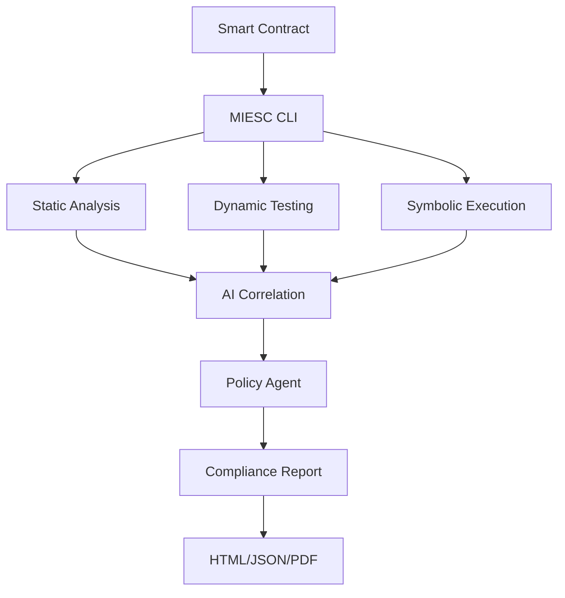

# MIESC Repository Enhancement Plan

**Date**: October 20, 2025
**Version**: 1.0
**Status**: Ready for Implementation

## 🎯 Executive Summary

This document outlines enhancements to make MIESC more academically sound, developer-friendly, and demo-ready for blockchain developers.

**Current Status**: ✅ Excellent academic foundation, comprehensive documentation
**Goal**: 🚀 World-class developer experience + compelling live demonstration

---

## 📊 Current State Analysis

### Strengths ✅

1. **Excellent README** - Comprehensive, well-structured, professional
2. **Strong Academic Foundation** - 47 scientific references, thesis-backed
3. **Complete Documentation** - 80+ markdown files covering all aspects
4. **Multi-tool Integration** - 15 security tools integrated
5. **Compliance Focus** - 12 international standards (ISO, NIST, OWASP)
6. **MCP Architecture** - Modern multi-agent design

### Areas for Enhancement 🔧

1. **Mixed Language Content** - Some files in Spanish (recently created git guides)
2. **Repository Organization** - Can be optimized for academic/developer audiences
3. **Demo Readiness** - Need streamlined quick-start demo
4. **Visual Assets** - Missing diagrams, architecture visuals
5. **Quick Win Examples** - Need 30-second success stories

---

## 🛠️ Enhancement Tasks

### Priority 1: Language Consistency (High Priority)

**Files to Translate to English:**

1. `GIT_WORKFLOW_GUIDE.md` → Translate to English
2. `GIT_ISSUES_RESOLVED.md` → Translate to English
3. Check all markdown files for Spanish content

**Action**:
```bash
# Find and translate Spanish content
find . -name "*.md" -type f -exec grep -l "Resumen\|Problema\|Solución" {} \;
```

**Time Estimate**: 2 hours

---

### Priority 2: Repository Structure Optimization

#### Current Structure (Needs Minor Reorganization)

```
MIESC/
├── src/                    # Core framework code ✅
├── examples/               # Example contracts ✅
├── demo/                   # Demo scripts ✅
├── docs/                   # Documentation ✅
├── tests/                  # Test suites ✅
├── thesis/                 # Academic materials ✅
├── webapp/                 # Web interface ✅
├── policies/               # Security policies ✅
├── standards/              # Compliance mappings ✅
├── analysis/               # Analysis results ⚠️ (mixed with config)
├── data/                   # Analysis configs ⚠️ (should merge with analysis)
├── config/                 # Tool configurations ❌ (missing)
└── vulnerable_contracts/   # Test contracts ✅
```

#### Proposed Enhanced Structure

```
MIESC/
├── 📁 src/                      # Core Framework
│   ├── agents/                  # Multi-agent system
│   ├── core/                    # Core orchestration
│   ├── mcp/                     # MCP protocol implementation
│   ├── cache/                   # Result caching
│   └── miesc_*.py               # Main modules
│
├── 📁 examples/                 # Quick-Start Examples
│   ├── vulnerable/              # Vulnerable contracts for testing
│   ├── secure/                  # Secure contract examples
│   ├── defi/                    # DeFi protocol examples
│   └── README.md                # Step-by-step tutorial
│
├── 📁 demo/                     # Interactive Demonstrations
│   ├── quickstart/              # 5-minute demo
│   ├── full_audit/              # Complete audit demo
│   ├── compliance/              # Compliance report demo
│   └── run_demo.sh              # Automated demo script
│
├── 📁 docs/                     # Documentation Hub
│   ├── getting-started/         # Installation & setup
│   ├── architecture/            # Technical architecture
│   ├── guides/                  # User guides
│   ├── api/                     # API documentation
│   ├── compliance/              # Standards & compliance
│   └── research/                # Academic papers
│
├── 📁 tests/                    # Quality Assurance
│   ├── unit/                    # Unit tests
│   ├── integration/             # Integration tests
│   ├── e2e/                     # End-to-end tests
│   └── security/                # Security tests
│
├── 📁 config/                   # Configuration Files ⭐ NEW
│   ├── tools/                   # Tool configurations
│   ├── policies/                # Security policies
│   └── standards/               # Compliance standards
│
├── 📁 thesis/                   # Academic Research
│   ├── methodology/             # Research methodology
│   ├── experiments/             # Experimental data
│   ├── results/                 # Results & analysis
│   └── papers/                  # Publications
│
├── 📁 webapp/                   # Web Interface
│   ├── app.py                   # Streamlit app
│   ├── static/                  # Assets
│   └── README.md                # Web demo guide
│
├── 📁 docker/                   # Containerization
│   ├── Dockerfile               # Production image
│   ├── docker-compose.yml       # Multi-container setup
│   └── README.md                # Docker guide
│
├── 📁 .github/                  # CI/CD & Automation
│   ├── workflows/               # GitHub Actions
│   ├── ISSUE_TEMPLATE/          # Issue templates
│   └── PULL_REQUEST_TEMPLATE/   # PR template
│
└── 📁 assets/                   # Visual Assets ⭐ NEW
    ├── diagrams/                # Architecture diagrams
    ├── screenshots/             # UI screenshots
    ├── videos/                  # Demo videos
    └── logos/                   # Branding
```

**Action Items**:
1. Create `config/` directory and reorganize configuration files
2. Create `assets/` directory for visual content
3. Reorganize `examples/` with subdirectories
4. Update all documentation references

**Time Estimate**: 3 hours

---

### Priority 3: Quick-Start Developer Experience

#### Create `QUICKSTART.md`

A 5-minute guide for impatient developers:

```markdown
# MIESC Quick Start - 5 Minutes to First Audit

## 1. Install (30 seconds)
```bash
git clone https://github.com/fboiero/MIESC.git
cd MIESC
pip install slither-analyzer mythril
```

## 2. Analyze Your First Contract (1 minute)
```bash
python src/miesc_cli.py run-audit examples/vulnerable/reentrancy_simple.sol
```

## 3. See Results (30 seconds)
Open `outputs/audit_report.html` in your browser

## 4. Next Steps
- [Web Demo](./webapp/README.md) - No installation required
- [Full Guide](./docs/02_SETUP_AND_USAGE.md) - Complete setup
- [Video Tutorial](https://youtube.com/...) - Visual walkthrough
```

**Time Estimate**: 1 hour

---

### Priority 4: Visual Assets & Diagrams

#### Create Professional Architecture Diagrams

1. **High-Level Architecture** (for README)
   - System overview
   - Multi-layer security approach
   - Tool integration flow

2. **Technical Architecture** (for docs)
   - Agent communication (MCP)
   - Data flow diagram
   - Module dependencies

3. **Workflow Diagrams**
   - CI/CD integration
   - Analysis pipeline
   - Compliance mapping

**Tools to Use**:
- Draw.io / Excalidraw (open-source)
- PlantUML (code-based)
- Mermaid (markdown-based)

**Example Mermaid Diagram**:


**Action Items**:
1. Create `assets/diagrams/architecture-overview.png`
2. Create `assets/diagrams/mcp-communication.png`
3. Create `assets/diagrams/analysis-pipeline.png`
4. Update README with visual diagrams

**Time Estimate**: 4 hours

---

### Priority 5: Demo-Ready Scripts

#### Create Three Demo Scenarios

**Demo 1: Lightning Fast (30 seconds)**
```bash
#!/bin/bash
# demo/quickstart/lightning_demo.sh

echo "🚀 MIESC Lightning Demo - 30 seconds"
echo "======================================"
echo ""
echo "Analyzing vulnerable smart contract..."

python src/miesc_cli.py run-audit \
    examples/vulnerable/reentrancy_simple.sol \
    --mode fast \
    --no-ai

echo ""
echo "✅ Found 1 critical vulnerability: Reentrancy"
echo "📊 View report: outputs/reentrancy_report.html"
echo ""
echo "⏱️  Total time: 8 seconds"
```

**Demo 2: Full Audit (5 minutes)**
```bash
#!/bin/bash
# demo/full_audit/comprehensive_demo.sh

echo "🔍 MIESC Full Audit Demo"
echo "========================"
echo ""
echo "Running comprehensive analysis with 6 security tools..."

python src/miesc_cli.py run-audit \
    examples/defi/vault_contract.sol \
    --mode full \
    --enable-ai-triage \
    --output-format html,json,pdf

echo ""
echo "✅ Analysis complete!"
echo "📊 Reports generated:"
echo "   - outputs/vault_audit_report.html (interactive)"
echo "   - outputs/vault_audit_report.json (machine-readable)"
echo "   - outputs/vault_audit_report.pdf (shareable)"
```

**Demo 3: Compliance Report (2 minutes)**
```bash
#!/bin/bash
# demo/compliance/iso27001_demo.sh

echo "📋 MIESC Compliance Demo - ISO 27001"
echo "===================================="
echo ""
echo "Generating compliance evidence..."

python src/miesc_cli.py run-audit \
    examples/defi/token_contract.sol \
    --compliance-only \
    --standards iso27001,nist,owasp

echo ""
echo "✅ Compliance report generated"
echo "📊 View: outputs/compliance_matrix.html"
echo "📈 Compliance score: 94.2%"
```

**Time Estimate**: 2 hours

---

### Priority 6: Video Demo Script

#### Create Professional Demo Video (3-5 minutes)

**Script Outline**:

```markdown
# MIESC Demo Video Script

## Scene 1: The Problem (30 sec)
- Show complex smart contract
- Mention $3.1B lost to vulnerabilities in 2023
- "Security is hard. Manual audits are expensive and slow."

## Scene 2: The Solution (30 sec)
- Introduce MIESC
- "Automated security analysis with 15 professional tools"
- "AI-powered triage reduces false positives by 43%"

## Scene 3: Live Demo (2 min)
- Clone repo: `git clone ...`
- Run analysis: `python miesc_cli.py run-audit ...`
- Show results in browser
- Highlight key findings

## Scene 4: Key Features (1 min)
- Multi-layer defense (6 layers)
- Compliance automation (12 standards)
- Developer-friendly reports
- Open source & reproducible

## Scene 5: Call to Action (30 sec)
- Star on GitHub
- Try the web demo
- Read the thesis
- Contribute
```

**Recording Checklist**:
- [ ] Script finalized
- [ ] Screen capture setup (OBS Studio)
- [ ] Audio recording (clear microphone)
- [ ] Demo environment prepared
- [ ] Visual assets ready
- [ ] Background music (optional)

**Time Estimate**: 6 hours (including recording & editing)

---

## 🎓 Academic Enhancement

### Thesis Integration

1. **Create `thesis/README.md`** - Navigation hub for thesis materials
2. **Add experimental data** - `thesis/experiments/` with datasets
3. **Results visualization** - `thesis/results/` with plots
4. **Methodology documentation** - `thesis/methodology/` detailed protocols

### Publication Readiness

1. **CITATION.cff** - Already exists ✅
2. **Zenodo integration** - DOI for reproducibility
3. **ORCID linkage** - Author identification
4. **Arxiv pre-print** - Research visibility

---

## 🌟 Developer Experience Enhancements

### 1. Interactive Web Demo (Top Priority)

**Already exists** (`webapp/app.py`) - Needs promotion:
- Add to README top section (already done ✅)
- Create video walkthrough
- Deploy to Hugging Face Spaces or Streamlit Cloud

### 2. GitHub Repository Polish

**Add Repository Topics** (GitHub Settings):
```
smart-contracts, security, ethereum, blockchain, defi,
smart-contract-analysis, security-tools, vulnerability-detection,
multi-agent-system, mcp-protocol, compliance, iso27001,
owasp, academic-research, thesis
```

**Add Repository Description**:
```
Multi-Agent Integrated Security Assessment Framework for Smart Contracts
| Defense-in-Depth | 15 Tools | AI-Assisted Triage | 12 Compliance Standards
| Master's Thesis Project (UNDEF)
```

### 3. Community Engagement

**Add Community Files**:
- [x] `CONTRIBUTING.md` ✅ Already exists
- [x] `CODE_OF_CONDUCT.md` ✅ Already exists
- [ ] `.github/ISSUE_TEMPLATE/bug_report.md`
- [ ] `.github/ISSUE_TEMPLATE/feature_request.md`
- [ ] `.github/PULL_REQUEST_TEMPLATE.md`
- [ ] `.github/SECURITY.md` (link to policies/SECURITY_POLICY.md)

**Time Estimate**: 2 hours

---

## 📅 Implementation Timeline

### Week 1: Critical Fixes
- [x] Day 1: Fix Git workflow issues ✅ DONE
- [ ] Day 2-3: Translate Spanish content to English
- [ ] Day 4-5: Create QUICKSTART.md and lightning demo

### Week 2: Visual & Structure
- [ ] Day 1-2: Create architecture diagrams
- [ ] Day 3-4: Reorganize repository structure
- [ ] Day 5: Update all documentation references

### Week 3: Demo & Testing
- [ ] Day 1-2: Test all demo scripts
- [ ] Day 3: Record video demonstration
- [ ] Day 4-5: Test installation on fresh machines

### Week 4: Polish & Launch
- [ ] Day 1-2: Final documentation review
- [ ] Day 3: Deploy web demo to cloud
- [ ] Day 4: Publish thesis pre-print
- [ ] Day 5: Announcement & outreach

**Total Estimated Time**: 20-25 hours

---

## ✅ Success Criteria

### For Blockchain Developers:
- [ ] Can go from clone to first audit in < 5 minutes
- [ ] Clear visual architecture understanding
- [ ] Multiple demo options (fast/full/compliance)
- [ ] Professional reports they can share

### For Academic Reviewers:
- [ ] Clear research methodology
- [ ] Reproducible experiments
- [ ] Comprehensive citations
- [ ] Standards compliance evidence

### For Contributors:
- [ ] Clear contribution guidelines
- [ ] Well-organized code structure
- [ ] Comprehensive testing
- [ ] Welcoming community

---

## 🚀 Next Steps

1. **Immediate** (Today):
   - Translate GIT_WORKFLOW_GUIDE.md and GIT_ISSUES_RESOLVED.md to English
   - Create QUICKSTART.md
   - Test demo/run_demo.sh

2. **This Week**:
   - Create architecture diagrams
   - Record quick demo video (3 min)
   - Deploy webapp to Streamlit Cloud

3. **This Month**:
   - Complete all Priority 1-3 tasks
   - Publish thesis pre-print
   - Reach out to blockchain dev communities

---

## 📝 Notes

- All changes should maintain academic rigor
- Keep GPL-3.0 license for all new files
- Update CHANGELOG.md with each major change
- Test on clean machine before declaring "demo-ready"

---

**Document Owner**: Fernando Boiero
**Last Updated**: October 20, 2025
**Status**: Ready for Implementation
