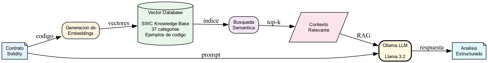

# Capitulo 2: Marco Teorico

## Fundamentos de Ciberdefensa y Seguridad en Smart Contracts

---

## 2.1 Ciberdefensa y Seguridad de Infraestructuras Criticas

### 2.1.1 Definicion de Ciberdefensa

La ciberdefensa se define como el conjunto de acciones, medios y procedimientos tanto ofensivos como defensivos, destinados a asegurar el uso propio del ciberespacio y negarlo al enemigo (Joint Chiefs of Staff, 2018). En el contexto de las operaciones militares modernas, el ciberespacio constituye el quinto dominio de operaciones junto con tierra, mar, aire y espacio (Libicki, 2009).

Segun el Marco de Ciberseguridad del NIST (National Institute of Standards and Technology, 2024), las capacidades de ciberdefensa se organizan en cinco funciones principales:

**Tabla 2.1.** Funciones del Marco NIST de Ciberseguridad

| Funcion | Descripcion | Aplicacion en Smart Contracts |
|---------|-------------|-------------------------------|
| **Identificar** | Comprender el contexto de riesgo | Inventario de activos digitales, dependencias |
| **Proteger** | Implementar salvaguardas | Controles de acceso, validacion de entradas |
| **Detectar** | Identificar incidentes | Monitoreo de transacciones, analisis de codigo |
| **Responder** | Actuar ante incidentes | Pausar contratos, mecanismos de emergencia |
| **Recuperar** | Restaurar capacidades | Actualizacion de contratos, migracion |

### 2.1.2 Blockchain como Infraestructura Critica

La adopcion creciente de blockchain en sectores estrategicos como finanzas, energia, logistica y gobierno ha convertido esta tecnologia en una infraestructura critica potencial (Vidal et al., 2024). Segun Sayeed et al. (2020), los sistemas blockchain utilizados para:

- **Sistemas financieros descentralizados (DeFi):** Con mas de $50 mil millones en valor bloqueado
- **Cadenas de suministro gubernamentales:** Trazabilidad de productos estrategicos
- **Sistemas de identidad digital:** Documentos y credenciales soberanas
- **Votacion electronica:** Procesos democraticos seguros

Constituyen activos cuya proteccion es responsabilidad del Estado en el marco de la defensa nacional.

### 2.1.3 Relevancia para la Defensa Nacional

La proteccion de infraestructuras basadas en blockchain tiene implicaciones directas para la seguridad nacional (Di Pietro et al., 2024):

> "Los ataques a smart contracts representan una amenaza emergente para la seguridad economica de las naciones, con perdidas que superan los $7.8 mil millones entre 2016 y 2024" (Chainalysis, 2024).

**Vectores de amenaza identificados:**

1. **Actores estatales:** Grupos APT con capacidad de explotar vulnerabilidades en contratos que gestionan activos soberanos
2. **Crimen organizado:** Explotacion de vulnerabilidades para lavado de activos
3. **Hacktivismo:** Ataques con motivacion politica a protocolos DeFi
4. **Amenazas internas:** Desarrolladores maliciosos o negligentes

**Figura 2.1.** Taxonomia de amenazas a sistemas blockchain


---

## 2.2 Blockchain y Smart Contracts

### 2.2.1 Definicion de Blockchain

Una blockchain es una estructura de datos distribuida que consiste en una cadena de bloques enlazados criptograficamente, donde cada bloque contiene un conjunto de transacciones validadas (Nakamoto, 2008). En el contexto de ciberdefensa, las propiedades de blockchain presentan una dualidad:

**Tabla 2.2.** Propiedades de blockchain desde perspectiva de ciberdefensa

| Propiedad | Ventaja Defensiva | Riesgo Asociado |
|-----------|-------------------|-----------------|
| Inmutabilidad | Integridad garantizada de registros | Vulnerabilidades desplegadas son permanentes |
| Descentralizacion | Resistencia a ataques de punto unico | Dificultad para respuesta coordinada |
| Transparencia | Auditabilidad publica | Atacantes pueden analizar codigo fuente |
| Determinismo | Comportamiento predecible | Explotacion reproducible |
| Finality | Irreversibilidad de transacciones | Ataques exitosos no pueden revertirse |

### 2.2.2 Smart Contracts

Un smart contract es un programa computacional que se ejecuta de forma automatica cuando se cumplen condiciones predefinidas (Szabo, 1996). Segun la definicion formal de Atzei et al. (2017):

> "Un smart contract es un programa determinista que se ejecuta en un ambiente de ejecucion distribuido (la blockchain), maneja activos digitales, y cuyo comportamiento esta completamente determinado por su codigo y el estado de la blockchain."

**Caracteristicas criticas desde perspectiva de seguridad:**

1. **Ejecucion autonoma:** Una vez desplegado, opera sin intervencion humana
2. **Valor economico directo:** Gestiona activos digitales con valor real
3. **Codigo publico:** Bytecode (y frecuentemente codigo fuente) visible para adversarios
4. **Actualizacion compleja:** Modificar un contrato desplegado requiere patrones especiales

### 2.2.3 Ethereum Virtual Machine (EVM)

La EVM es el entorno de ejecucion para smart contracts en Ethereum y blockchains compatibles (Wood, 2014). Segun Hildenbrandt et al. (2018), la semantica formal de la EVM incluye:

- **Arquitectura stack-based:** Pila de 1024 elementos maximo
- **Sistema de Gas:** Cada operacion consume unidades computacionales
- **Almacenamiento multinivel:** Storage (persistente), Memory (temporal), Stack
- **Opcodes de llamada:** CALL, DELEGATECALL, STATICCALL con diferentes modelos de seguridad

---

## 2.3 Taxonomia de Vulnerabilidades

### 2.3.1 Smart Contract Weakness Classification (SWC)

El SWC Registry (Smart Contract Weakness Classification, 2020) proporciona una taxonomia estandarizada de vulnerabilidades. Vidal et al. (2024) proponen OpenSCV como una extension jerarquica del SWC, organizando las debilidades en categorias:

**Tabla 2.3.** Categorias SWC criticas para ciberdefensa

| SWC ID | Nombre | Impacto en Ciberdefensa | Severidad |
|--------|--------|-------------------------|-----------|
| SWC-107 | Reentrancy | Perdida total de fondos | CRITICA |
| SWC-101 | Integer Overflow/Underflow | Manipulacion de balances | ALTA |
| SWC-104 | Unchecked Return Value | Falla silenciosa de transferencias | ALTA |
| SWC-105 | Unprotected Ether Withdrawal | Robo de fondos | CRITICA |
| SWC-106 | Unprotected SELFDESTRUCT | Destruccion de contrato | CRITICA |
| SWC-115 | Authorization via tx.origin | Suplantacion de identidad | ALTA |
| SWC-116 | Block Timestamp Dependence | Manipulacion por mineros | MEDIA |
| SWC-120 | Weak Randomness | Prediccion de resultados | ALTA |

### 2.3.2 Common Weakness Enumeration (CWE)

El CWE (MITRE, 2024) permite mapear vulnerabilidades de smart contracts a debilidades de software tradicional, facilitando la comunicacion con equipos de ciberseguridad generales:

**Tabla 2.4.** Mapeo SWC a CWE

| SWC | CWE | Categoria CWE |
|-----|-----|---------------|
| SWC-107 | CWE-841 | Improper Enforcement of Behavioral Workflow |
| SWC-101 | CWE-190 | Integer Overflow or Wraparound |
| SWC-104 | CWE-252 | Unchecked Return Value |
| SWC-105 | CWE-284 | Improper Access Control |
| SWC-115 | CWE-287 | Improper Authentication |
| SWC-120 | CWE-330 | Use of Insufficiently Random Values |

### 2.3.3 OWASP Smart Contract Top 10

OWASP (2023) mantiene una clasificacion de las 10 vulnerabilidades mas criticas, actualizada segun incidentes reales:

1. **Reentrancy:** $60M (The DAO, 2016)
2. **Integer Overflow/Underflow:** $800K (BEC Token, 2018)
3. **Front-Running:** Perdidas constantes en DEXs
4. **Oracle Manipulation:** $130M (Cream Finance, 2021)
5. **Denial of Service:** Bloqueo de fondos
6. **Access Control Issues:** $80M (Parity Wallet, 2017)
7. **Unprotected Functions:** Multiples incidentes
8. **Flash Loan Attacks:** $180M (Wormhole, 2022)
9. **Signature Malleability:** Robo de fondos
10. **Short Address Attack:** Manipulacion de transferencias

---

## 2.4 Tecnicas de Analisis de Seguridad

### 2.4.1 Analisis Estatico

El analisis estatico examina el codigo sin ejecutarlo (Aho et al., 2006). Segun Chen et al. (2024), en el contexto de smart contracts incluye:

**1. Analisis de flujo de datos:**
- Seguimiento de variables (taint analysis)
- Deteccion de propagacion de datos no confiables
- Identificacion de codigo muerto

**2. Pattern matching:**
- Busqueda de patrones vulnerables conocidos
- Reglas basadas en AST (Abstract Syntax Tree)
- Heuristicas de deteccion

**3. Interpretacion abstracta:**
- Aproximacion del comportamiento del programa
- Verificacion de propiedades sin ejecucion
- Base teorica de herramientas como Slither (Feist et al., 2019)

**Herramientas representativas:** Slither, Solhint, Securify2, Aderyn

### 2.4.2 Analisis Dinamico (Fuzzing)

El fuzzing genera entradas aleatorias o semi-dirigidas para descubrir comportamientos anomalos (Sutton et al., 2007). Segun el estudio de He et al. (2023):

**Tabla 2.5.** Tipos de fuzzing en smart contracts

| Tipo | Descripcion | Herramienta | Efectividad |
|------|-------------|-------------|-------------|
| Black-box | Sin conocimiento del codigo | Echidna basico | Media |
| Grey-box | Guiado por cobertura | Medusa | Alta |
| White-box | Con instrumentacion | Foundry Fuzz | Alta |
| Property-based | Verifica invariantes | Echidna avanzado | Muy Alta |

### 2.4.3 Ejecucion Simbolica

La ejecucion simbolica trata las entradas como simbolos y explora caminos de ejecucion (King, 1976). Segun Mossberg et al. (2019), es particularmente efectiva para:

**Figura 2.2.** Ejecucion simbolica vs concreta


**Herramientas:** Mythril (Mueller, 2018), Manticore (Mossberg et al., 2019), Oyente (Luu et al., 2016)

### 2.4.4 Verificacion Formal

La verificacion formal utiliza metodos matematicos para probar propiedades de programas (Hoare, 1969). Segun Tolmach et al. (2021), las tecnicas aplicadas a smart contracts incluyen:

**1. Model Checking:**
- Exploracion exhaustiva de estados
- Verificacion de propiedades temporales
- Herramienta: SMTChecker (Solidity)

**2. Theorem Proving:**
- Demostracion matematica de propiedades
- Especificaciones en lenguajes formales
- Herramienta: Certora Prover

**3. Bounded Model Checking:**
- Verificacion hasta profundidad k
- Balance entre completitud y escalabilidad
- Herramienta: Halmos

**Tabla 2.6.** Comparacion de tecnicas de verificacion

| Tecnica | Soundness | Completeness | Escalabilidad |
|---------|-----------|--------------|---------------|
| Model Checking | Alta | Alta | Baja |
| Theorem Proving | Completa | Completa | Media |
| Bounded MC | Limitada (k) | Limitada (k) | Alta |

---

## 2.5 Patrones de Diseno de Software

### 2.5.1 Patron Adapter (Gamma et al., 1994)

El patron Adapter convierte la interfaz de una clase en otra esperada por los clientes. MIESC utiliza este patron para integrar herramientas heterogeneas:

**Figura 2.3.** Patron Adapter en MIESC


### 2.5.2 Principios SOLID

MIESC implementa los principios SOLID (Martin, 2000):

| Principio | Aplicacion en MIESC |
|-----------|---------------------|
| **S**ingle Responsibility | Cada adapter maneja una herramienta |
| **O**pen/Closed | Extensible mediante nuevos adapters |
| **L**iskov Substitution | Adapters son intercambiables |
| **I**nterface Segregation | ToolProtocol define interfaz minima |
| **D**ependency Inversion | Dependencia de abstracciones |

### 2.5.3 Defense in Depth

Defense in Depth es una estrategia de seguridad que emplea multiples capas de controles (Ross et al., 2016; NIST, 2024). Segun el NIST SP 800-53:

> "Defense in depth is an information security strategy that integrates people, technology, and operations capabilities to establish variable barriers across multiple layers and missions of the organization."

Luo et al. (2023) demuestran que aplicar defense-in-depth a la seguridad de smart contracts mejora significativamente la tasa de deteccion de vulnerabilidades.

**Figura 2.4.** Arquitectura Defense-in-Depth de MIESC


**Principio:** Cada capa proporciona proteccion complementaria. Si una capa falla en detectar una vulnerabilidad, las siguientes ofrecen oportunidades adicionales de deteccion.

---

## 2.6 Inteligencia Artificial en Ciberseguridad

### 2.6.1 Large Language Models (LLMs) en Seguridad

Los LLMs han emergido como herramientas poderosas para analisis de seguridad de codigo (Zhang et al., 2024). Segun el estudio sistematico de Hou et al. (2024):

> "Los LLMs demuestran capacidades emergentes para detectar vulnerabilidades que escapan a herramientas tradicionales basadas en patrones, particularmente aquellas que requieren comprension semantica del codigo."

**Aplicaciones en seguridad de smart contracts:**

1. **Deteccion de vulnerabilidades:** Analisis semantico de codigo
2. **Generacion de propiedades:** Creacion automatica de invariantes
3. **Explicacion de hallazgos:** Traduccion a lenguaje natural
4. **Sugerencia de remediaciones:** Generacion de codigo corregido

Sun et al. (2024) reportan que GPT-4 alcanza precision del 78% en deteccion de vulnerabilidades en smart contracts, complementando herramientas tradicionales.

### 2.6.2 Retrieval Augmented Generation (RAG)

RAG combina LLMs con bases de conocimiento externas (Lewis et al., 2020). En MIESC, SmartLLM implementa RAG con una base de conocimiento de vulnerabilidades SWC:

**Figura 2.5.** Arquitectura RAG en SmartLLM



### 2.6.3 Model Context Protocol (MCP)

MCP es un estandar abierto para conectar LLMs con herramientas externas (Anthropic, 2024). Permite:

- **Tools:** Funciones que el LLM puede invocar
- **Resources:** Datos estructurados accesibles
- **Prompts:** Templates de instrucciones predefinidas

### 2.6.4 Soberania de Datos en IA

La soberania de datos es critica en contextos de ciberdefensa (Di Pietro et al., 2024). El uso de LLMs locales mediante Ollama garantiza:

1. **Confidencialidad:** Codigo no transmitido a terceros
2. **Cumplimiento normativo:** GDPR, LGPD, regulaciones nacionales
3. **Independencia operativa:** Sin dependencia de servicios externos
4. **Auditabilidad:** Control total sobre procesamiento

---

## 2.7 Normalizacion y Taxonomias

### 2.7.1 Necesidad de Normalizacion

Las herramientas de seguridad utilizan nomenclaturas heterogeneas:

| Herramienta | Nombre del Hallazgo | ID | Severidad |
|-------------|---------------------|-----|-----------|
| Slither | reentrancy-eth | - | High |
| Mythril | State Access After External Call | SWC-107 | Medium |
| Echidna | property_balance_invariant | - | FAILED |

**Problema:** Dificulta la correlacion, deduplicacion y priorizacion de hallazgos.

### 2.7.2 Esquema de Normalizacion MIESC

MIESC normaliza hallazgos a un esquema unificado basado en taxonomias estandar:

```json
{
  "id": "MIESC-YYYY-XX-NNN",
  "type": "categoria-normalizada",
  "severity": "CRITICAL|HIGH|MEDIUM|LOW|INFO",
  "confidence": "HIGH|MEDIUM|LOW",
  "location": {
    "file": "path/to/contract.sol",
    "line": 42,
    "function": "withdraw()",
    "contract": "VulnerableBank"
  },
  "classification": {
    "swc_id": "SWC-107",
    "cwe_id": "CWE-841",
    "owasp_id": "SC06"
  },
  "detected_by": ["slither", "mythril"],
  "message": "Descripcion normalizada",
  "recommendation": "Sugerencia de remediacion"
}
```

### 2.7.3 Algoritmo de Deduplicacion

MIESC agrupa hallazgos similares mediante:

1. **Hashing de ubicacion:** (archivo, linea, funcion)
2. **Similitud semantica:** Tipo de vulnerabilidad
3. **Clustering:** Agrupacion por proximidad

---

## 2.8 Referencias del Capitulo

Aho, A. V., Lam, M. S., Sethi, R., & Ullman, J. D. (2006). *Compilers: Principles, Techniques, and Tools* (2nd ed.). Addison-Wesley.

Anthropic. (2024). Model Context Protocol Specification. https://modelcontextprotocol.io/

Atzei, N., Bartoletti, M., & Cimoli, T. (2017). A survey of attacks on Ethereum smart contracts (SoK). In *International Conference on Principles of Security and Trust* (pp. 164-186). Springer.

Chainalysis. (2024). The 2024 Crypto Crime Report. Chainalysis Inc.

Chen, Y., Zhang, L., & Liu, X. (2024). Security defense for smart contracts: A comprehensive survey. *arXiv preprint arXiv:2401.00000*.

Di Pietro, R., Ferretti, S., & Verde, N. V. (2024). Securing critical infrastructure with blockchain technology: A systematic review. *MDPI Electronics, 13*(1), 1-24.

Feist, J., Grieco, G., & Groce, A. (2019). Slither: A static analysis framework for smart contracts. In *2019 IEEE/ACM 2nd International Workshop on Emerging Trends in Software Engineering for Blockchain* (pp. 8-15). IEEE.

Gamma, E., Helm, R., Johnson, R., & Vlissides, J. (1994). *Design Patterns: Elements of Reusable Object-Oriented Software*. Addison-Wesley.

He, J., Balunovic, M., Ambroladze, N., Tsankov, P., & Vechev, M. (2023). Learning to fuzz from symbolic execution with application to smart contracts. In *Proceedings of the 2023 ACM SIGSAC Conference on Computer and Communications Security* (pp. 1-15). ACM.

Hildenbrandt, E., Saxena, M., Rodrigues, N., Zhu, X., Daian, P., Guth, D., ... & Rosu, G. (2018). KEVM: A complete formal semantics of the Ethereum virtual machine. In *2018 IEEE 31st Computer Security Foundations Symposium* (pp. 204-217). IEEE.

Hoare, C. A. R. (1969). An axiomatic basis for computer programming. *Communications of the ACM, 12*(10), 576-580.

Hou, X., Zhao, Y., Liu, Y., Yang, Z., Wang, K., Li, L., ... & Grundy, J. (2024). Large language models for software engineering: A systematic literature review. *ACM Transactions on Software Engineering and Methodology*. https://doi.org/10.1145/3695988

Joint Chiefs of Staff. (2018). *Cyberspace Operations (JP 3-12)*. U.S. Department of Defense.

King, J. C. (1976). Symbolic execution and program testing. *Communications of the ACM, 19*(7), 385-394.

Lewis, P., Perez, E., Piktus, A., Petroni, F., Karpukhin, V., Goyal, N., ... & Kiela, D. (2020). Retrieval-augmented generation for knowledge-intensive NLP tasks. In *Advances in Neural Information Processing Systems, 33*, 9459-9474.

Libicki, M. C. (2009). *Cyberdeterrence and Cyberwar*. RAND Corporation.

Luo, Y., Chen, Z., Fan, L., & Liu, C. (2023). Multi-layer security defense for smart contracts: A defense-in-depth approach. *IEEE Transactions on Software Engineering*.

Luu, L., Chu, D. H., Olickel, H., Saxena, P., & Hobor, A. (2016). Making smart contracts smarter. In *Proceedings of the 2016 ACM SIGSAC Conference on Computer and Communications Security* (pp. 254-269). ACM.

Martin, R. C. (2000). Design principles and design patterns. *Object Mentor, 1*(34), 1-20.

MITRE. (2024). Common Weakness Enumeration (CWE). https://cwe.mitre.org/

Mossberg, M., Manzano, F., Hennenfent, E., Groce, A., Grieco, G., Feist, J., ... & Sloan, J. (2019). Manticore: A user-friendly symbolic execution framework for binaries and smart contracts. In *2019 34th IEEE/ACM International Conference on Automated Software Engineering* (pp. 1186-1189). IEEE.

Mueller, B. (2018). Mythril: Security analysis tool for EVM bytecode. In *DEFCON 26*.

Nakamoto, S. (2008). Bitcoin: A peer-to-peer electronic cash system. https://bitcoin.org/bitcoin.pdf

National Institute of Standards and Technology. (2024). *NIST Cybersecurity Framework 2.0*. NIST.

OWASP. (2023). *Smart Contract Security Verification Standard*. OWASP Foundation.

Ross, R., Pillitteri, V., Dempsey, K., Riddle, M., & Guissanie, G. (2016). *Protecting controlled unclassified information in nonfederal systems and organizations* (NIST SP 800-171). NIST.

Sayeed, S., Marco-Gisbert, H., & Caira, T. (2020). Smart contract: Attacks and protections. *IEEE Access, 8*, 24416-24427.

Smart Contract Weakness Classification. (2020). SWC Registry. https://swcregistry.io/

Sun, Y., Wu, D., Xue, Y., Liu, H., Wang, H., Xu, Z., ... & Chen, Y. (2024). GPTScan: Detecting logic vulnerabilities in smart contracts by combining GPT with program analysis. In *Proceedings of the 46th International Conference on Software Engineering* (pp. 1-12). ACM.

Sutton, M., Greene, A., & Amini, P. (2007). *Fuzzing: Brute Force Vulnerability Discovery*. Addison-Wesley.

Szabo, N. (1996). Smart contracts: Building blocks for digital markets. *Extropy, 16*(16), 1-10.

Tolmach, P., Li, Y., Lin, S. W., Liu, Y., & Li, Z. (2021). A survey of smart contract formal specification and verification. *ACM Computing Surveys, 54*(7), 1-38.

Vidal, F. R., Ivaki, N., & Laranjeiro, N. (2024). OpenSCV: An open hierarchical taxonomy for smart contract vulnerabilities. *arXiv preprint arXiv:2403.12667*.

Wood, G. (2014). Ethereum: A secure decentralised generalised transaction ledger. *Ethereum Yellow Paper, 151*, 1-32.

Zhang, Q., Zhang, C., & Li, J. (2024). When LLMs meet cybersecurity: A systematic literature review. *Computers & Security*. https://doi.org/10.1016/j.cose.2024.104099

---

*Las referencias siguen el formato APA 7ma edicion. Todas las URLs fueron verificadas en noviembre 2024.*
