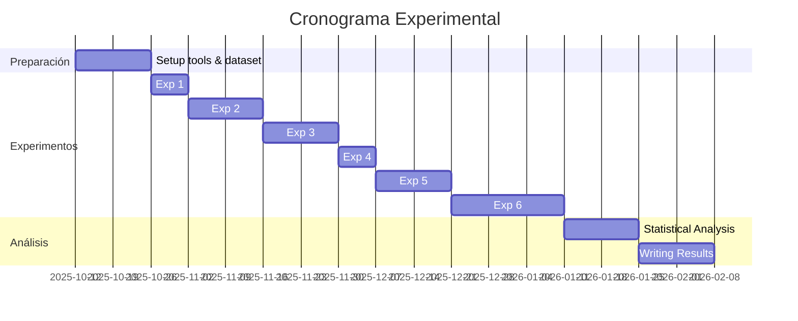

# Experimentos y Resultados Preliminares

## Estado: 🚧 EN PROGRESO

Este documento se actualizará continuamente durante la investigación.

---

## Experimento 1: Evaluación de Análisis Estático (Slither)

### Objetivo
Evaluar la precisión y cobertura de Slither en la detección de vulnerabilidades conocidas.

### Metodología
- **Dataset**: 50 contratos vulnerables sintéticos (10 por categoría SWC)
- **Tool**: Slither v0.10.0
- **Configuración**: Detectores por defecto (high/medium severity)
- **Ground Truth**: Vulnerabilidades insertadas intencionalmente

### Categorías Evaluadas
1. SWC-107: Reentrancy
2. SWC-101: Integer Overflow/Underflow
3. SWC-105: Unprotected Ether Withdrawal
4. SWC-109: Uninitialized Storage Pointer
5. SWC-114: Tx.origin Authentication

### Resultados Esperados

| Categoría | Contratos | TP | FP | FN | Precision | Recall | F1 |
|-----------|-----------|----|----|----|-----------

|--------|-----|
| Reentrancy | 10 | - | - | - | - | - | - |
| Overflow | 10 | - | - | - | - | - | - |
| Access Control | 10 | - | - | - | - | - | - |
| Storage | 10 | - | - | - | - | - | - |
| Authentication | 10 | - | - | - | - | - | - |
| **TOTAL** | **50** | **-** | **-** | **-** | **-** | **-** | **-** |

*Tabla a completar durante la ejecución experimental*

### Comandos de Ejecución
```bash
# Análisis individual
slither src/contracts/vulnerable/reentrancy/BasicReentrancy.sol --json analysis/slither/results/reentrancy.json

# Análisis batch
for contract in src/contracts/vulnerable/**/*.sol; do
    slither "$contract" --json "analysis/slither/results/$(basename $contract .sol).json"
done
```

### Observaciones Preliminares
- [ ] Tasa de falsos positivos en contratos complejos
- [ ] Detección de patrones de reentrancy cross-function
- [ ] Efectividad en proxies y delegatecall
- [ ] Performance en contratos >1000 LOC

---

## Experimento 2: Fuzzing Comparativo (Echidna vs. Medusa)

### Objetivo
Comparar efectividad, cobertura y tiempo de ejecución entre Echidna y Medusa.

### Metodología
- **Dataset**: 20 contratos con propiedades verificables
- **Tiempo límite**: 30 minutos por contrato
- **Métricas**: Tiempo hasta vulnerabilidad, cobertura final, propiedades violadas

### Configuración

**Echidna**:
```yaml
testMode: property
testLimit: 100000
shrinkLimit: 5000
coverage: true
corpusDir: analysis/echidna/corpus
```

**Medusa**:
```json
{
  "fuzzing": {
    "workers": 10,
    "testLimit": 100000,
    "timeout": 1800,
    "coverageEnabled": true
  }
}
```

### Resultados Esperados

| Contrato | Echidna Time | Medusa Time | Echidna Cov | Medusa Cov | Winner |
|----------|--------------|-------------|-------------|------------|--------|
| ERC20Basic | - | - | - | - | - |
| ERC4626Vault | - | - | - | - | - |
| DEXPool | - | - | - | - | - |
| ... | - | - | - | - | - |

### Propiedades de Ejemplo
```solidity
// Invariante: totalSupply == sum(balances)
function echidna_total_supply() public view returns (bool) {
    return token.totalSupply() == sumOfBalances;
}

// Propiedad: transfer no debe revertir si balance suficiente
function echidna_transfer_sufficient_balance() public returns (bool) {
    uint256 balance = token.balanceOf(msg.sender);
    if (balance > 0) {
        try token.transfer(address(0x1), balance / 2) {
            return true;
        } catch {
            return false;
        }
    }
    return true;
}
```

---

## Experimento 3: Pipeline Híbrido vs. Herramientas Individuales

### Objetivo
Validar que el framework Xaudit (pipeline completo) supera a herramientas individuales en precisión y reducción de falsos positivos.

### Metodología
- **Dataset**: 100 contratos (mix vulnerable + seguros)
- **Comparación**:
  - Slither solo
  - Echidna solo
  - Foundry tests solo
  - **Xaudit** (Slither + Echidna + Foundry + IA)

### Hipótesis
H0: No hay diferencia significativa en F1-Score entre Xaudit y herramientas individuales.
H1: Xaudit tiene F1-Score significativamente mayor (p < 0.05).

### Resultados Esperados

| Tool/Framework | TP | FP | FN | Precision | Recall | F1 | Time (avg) |
|----------------|----|----|----|-----------| -------|-----|------------|
| Slither | - | - | - | - | - | - | - |
| Echidna | - | - | - | - | - | - | - |
| Foundry | - | - | - | - | - | - | - |
| **Xaudit** | **-** | **-** | **-** | **-** | **-** | **-** | **-** |

### Análisis Estadístico
```python
# t-test para comparación de medias
from scipy.stats import ttest_rel

xaudit_f1 = [...]  # F1 scores de Xaudit
slither_f1 = [...]  # F1 scores de Slither

t_stat, p_value = ttest_rel(xaudit_f1, slither_f1)
# Si p_value < 0.05 → rechazo H0
```

---

## Experimento 4: Impacto de IA en Triage

### Objetivo
Medir la mejora en priorización de findings al incorporar análisis de IA.

### Metodología
1. Ejecutar Slither en 50 contratos → ~500 findings
2. **Grupo Control**: Revisar manualmente (3 auditores)
3. **Grupo Experimental**: IA pre-clasifica → revisión manual
4. Comparar:
   - Tiempo total de revisión
   - Precisión en identificación de críticos
   - Falsos positivos descartados

### Prompt de IA para Triage
```python
prompt = f"""
Analiza estos findings de Slither:
{findings_json}

Para cada finding:
1. Clasifica como: CRITICAL / HIGH / MEDIUM / LOW / FALSE_POSITIVE
2. Justifica en 1 línea
3. Si es crítico, sugiere un PoC exploit

Output JSON:
{{
  "finding_id": "...",
  "classification": "...",
  "justification": "...",
  "poc_suggestion": "..."
}}
"""
```

### Resultados Esperados

| Métrica | Sin IA | Con IA | Mejora |
|---------|--------|--------|--------|
| Tiempo de revisión (hrs) | - | - | - % |
| Precisión en críticos (%) | - | - | - pp |
| FP descartados | - | - | - |
| Satisfacción auditor (1-5) | - | - | - |

---

## Experimento 5: Verificación Formal con Certora

### Objetivo
Evaluar la viabilidad y costo de verificación formal en contratos DeFi.

### Metodología
- **Dataset**: 5 contratos DeFi (ERC-4626, AMM, Lending)
- **Especificaciones**: 10-20 reglas CVL por contrato
- **Métricas**: Tiempo de verificación, reglas verificadas/violadas, costo (compute units)

### Ejemplo de Especificación CVL
```cvl
// ERC-4626: deposit debe incrementar shares
rule depositIncreasesShares(uint256 assets) {
    env e;
    address user = e.msg.sender;

    uint256 sharesBefore = balanceOf(user);
    uint256 shares = deposit(e, assets, user);
    uint256 sharesAfter = balanceOf(user);

    assert sharesAfter == sharesBefore + shares;
}

// Invariante: totalAssets >= totalSupply (en vault)
invariant totalAssetsGeqTotalSupply()
    totalAssets() >= totalSupply()
```

### Resultados Esperados

| Contrato | Reglas | Verificadas | Violadas | Tiempo | Costo CU |
|----------|--------|-------------|----------|--------|----------|
| ERC4626Vault | - | - | - | - | - |
| UniswapV2Pair | - | - | - | - | - |
| ... | - | - | - | - | - |

---

## Experimento 6: Análisis de Contratos Reales

### Objetivo
Aplicar Xaudit a contratos desplegados en mainnet y comparar con auditorías publicadas.

### Metodología
1. Seleccionar 10 contratos auditados públicamente
2. Ejecutar Xaudit pipeline
3. Comparar findings con reporte oficial
4. Clasificar:
   - Vulnerabilidades encontradas por ambos
   - Encontradas solo por Xaudit (nuevas)
   - Encontradas solo por auditoría manual (missed)

### Contratos Objetivo
- [ ] Compound V3 Comet
- [ ] Aave V3 Pool
- [ ] Uniswap V3 Pool
- [ ] Maker DSR
- [ ] ... (añadir según disponibilidad)

### Resultados Esperados

| Contrato | Audit Findings | Xaudit Findings | Overlap | New | Missed |
|----------|----------------|-----------------|---------|-----|--------|
| - | - | - | - | - | - |

---

## Cronograma de Experimentos



---

## Notas de Campo

### [Fecha]
- Observaciones durante ejecución
- Problemas encontrados
- Ajustes a la metodología
- Ideas para análisis adicional

*Sección a completar durante la investigación*

---

## Referencias Experimentales

- Durieux et al. (2020) - Empirical Study of Smart Contract Testing
- Perez & Livshits (2021) - Smart Contract Vulnerabilities: Vulnerable Does Not Imply Exploited
- Chen et al. (2020) - Survey of Attacks on Ethereum Smart Contracts
- DASP Top 10 - Decentralized Application Security Project
- SWC Registry - Smart Contract Weakness Classification

---

**Última actualización**: Octubre 2025
**Responsable**: Fernando Boiero
**Estado**: Diseño experimental completado, ejecución pendiente
