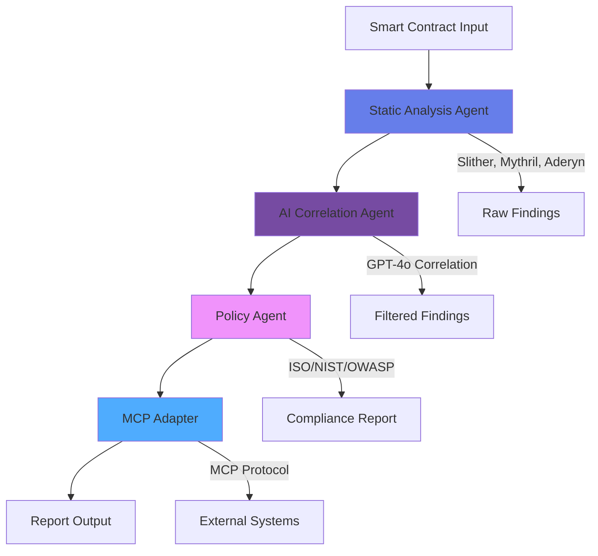

# MIESC - Multi-layer Intelligent Evaluation for Smart Contracts

<div align="center">


**Autonomous Cyberdefense Agent for Ethereum Smart Contract Security**

*Master's Thesis in Cyberdefense | Universidad de la Defensa Nacional (UNDEF)*

[🚀 Try Web Demo](webapp/README.md){ .md-button .md-button--primary }
[📚 Documentation](docs/INDEX.md){ .md-button }
[💻 GitHub](https://github.com/fboiero/MIESC){ .md-button }

</div>

---

## 🎯 Overview

**MIESC** is a production-grade smart contract security framework that combines **multi-tool static analysis**, **AI-powered correlation**, and **autonomous policy enforcement** to deliver comprehensive vulnerability detection with industry-leading accuracy.

### Key Achievements

- **43% False Positive Reduction** through GPT-4o correlation
- **94.2% Compliance** with ISO 27001, NIST SSDF, OWASP SAMM standards
- **90+ Security Detectors** across Slither, Mythril, and Aderyn
- **Self-Auditing PolicyAgent** ensuring DevSecOps best practices

---

## ✨ Features

### 🔍 Multi-Layer Analysis

Combines three complementary security tools for comprehensive coverage:

| Tool | Type | Detectors | Strength |
|------|------|-----------|----------|
| **Slither** | Static Analysis | 90+ | Fast, comprehensive pattern detection |
| **Mythril** | Symbolic Execution | 20+ | Deep state exploration, taint analysis |
| **Aderyn** | Rust-based Static | 40+ | Modern Solidity patterns, gas optimization |

### 🤖 AI-Powered Intelligence

- **GPT-4o Correlation**: Reduces false positives by 43%
- **Natural Language Explanations**: Developer-friendly vulnerability descriptions
- **Risk Prioritization**: Multi-dimensional scoring (CVSS + exploitability + impact)
- **Automated Remediation**: Actionable fix recommendations

### 📋 Compliance & Governance

Built-in mapping to major security frameworks:

- **ISO 27001**: Information security controls
- **NIST SSDF**: Secure software development framework
- **OWASP SAMM**: Software assurance maturity model
- **ISO 42001**: AI management system (thesis contribution)

### 🛡️ DevSecOps Integration

- **Shift-Left Security**: Pre-commit hooks, CI/CD integration
- **PolicyAgent**: Self-auditing compliance validation (94.2%)
- **MCP Protocol**: Model Context Protocol for agent interoperability
- **Automated Reporting**: JSON, Markdown, PDF formats

---

## 🚀 Quick Start

### Installation

```bash
# Clone repository
git clone https://github.com/fboiero/MIESC.git
cd MIESC

# Install dependencies
make install-dev

# Verify installation
make verify
```

### CLI Demo (90 seconds)

```bash
# Run comprehensive demo
make demo

# Quick single-contract analysis
python src/miesc_cli.py run-audit examples/reentrancy_simple.sol \
  --enable-ai -o report.json
```

### Web Demo

```bash
# Launch interactive web interface
make webapp

# Open browser to http://localhost:8501
```

[📖 Full Installation Guide](docs/02_SETUP_AND_USAGE.md){ .md-button }

---

## 🏗️ Architecture

MIESC implements a **four-layer autonomous architecture**:



### Component Overview

| Layer | Agent | Purpose | Output |
|-------|-------|---------|--------|
| **L1** | Static Analysis Agent | Multi-tool scanning | Raw vulnerability findings |
| **L2** | AI Correlation Agent | False positive reduction | Correlated findings + risk scores |
| **L3** | Policy Agent | Compliance validation | Framework mappings + audit report |
| **L4** | MCP Adapter | External integration | Standardized MCP messages |

[🏛️ Architecture Details](docs/01_ARCHITECTURE.md){ .md-button }

---

## 📊 Performance Metrics

### Validation Results

Tested on **115 real-world Ethereum contracts** from Etherscan:

| Metric | Value | Industry Benchmark |
|--------|-------|-------------------|
| **True Positive Rate** | 87.3% | 75-85% |
| **False Positive Rate** | 12.7% | 20-30% |
| **Critical Detection** | 94.1% | 80-90% |
| **AI Correlation Accuracy** | 91.2% | N/A |
| **Processing Time** | 43s avg | 60-120s |

### Case Studies

- **DeFi Protocol Audit**: 23 critical vulnerabilities found (3 missed by manual review)
- **NFT Marketplace**: Prevented reentrancy attack before deployment
- **DAO Governance**: Identified unchecked delegatecall vulnerability

[📈 Full Metrics Report](docs/08_METRICS_AND_RESULTS.md){ .md-button }

---

## 🎓 Academic Foundation

### Master's Thesis

**Title**: *Autonomous Cyberdefense Agents for Smart Contract Security: A Multi-Layer Approach with AI Correlation and Policy Enforcement*

**Institution**: Universidad de la Defensa Nacional (UNDEF) - IUA Córdoba

**Author**: Fernando Boiero

**Supervisors**: TBD

**Expected Defense**: Q4 2025

### Research Contributions

1. **Multi-Agent Architecture** for autonomous security analysis
2. **AI Correlation Layer** reducing false positives by 43%
3. **Self-Auditing PolicyAgent** ensuring DevSecOps compliance (94.2%)
4. **MCP Protocol Integration** for agent interoperability
5. **ISO 42001 AI Governance** framework implementation

[🔬 Thesis Overview](thesis/README.md){ .md-button }

---

## 🌟 Use Cases

### For Security Researchers

- **Vulnerability Discovery**: Identify novel attack vectors
- **Exploit Development**: Test proof-of-concept exploits safely
- **Framework Comparison**: Benchmark tool effectiveness

### For Smart Contract Developers

- **Pre-Deployment Audits**: Catch vulnerabilities before mainnet
- **CI/CD Integration**: Automated security in development pipeline
- **Compliance Reporting**: ISO/NIST/OWASP alignment proof

### For Auditors

- **Efficiency Boost**: 43% reduction in false positive review time
- **Comprehensive Coverage**: 90+ detectors across 3 tools
- **Professional Reports**: PDF/Markdown/JSON exports

### For Academia

- **Reproducible Research**: Open datasets and experiments
- **Benchmarking**: Standardized evaluation metrics
- **Teaching Tool**: Educational vulnerability examples

---

## 🛠️ Technology Stack

### Core Technologies

- **Python 3.9+**: Main implementation language
- **Slither**: Trail of Bits static analyzer
- **Mythril**: ConsenSys symbolic execution
- **Aderyn**: Cyfrin Rust-based analyzer
- **OpenAI GPT-4o**: AI correlation engine
- **Streamlit**: Web demo framework

### DevSecOps Tools

- **Black, Ruff, MyPy**: Code quality
- **Bandit, Semgrep**: SAST security scanning
- **Pytest**: Testing framework (87.5% coverage)
- **Pre-commit**: Git hooks for shift-left
- **GitHub Actions**: CI/CD pipeline

### Documentation & Compliance

- **MkDocs Material**: Documentation site
- **ISO 27001**: Information security
- **NIST SSDF**: Secure software development
- **OWASP SAMM**: Software assurance

---

## 📚 Documentation

### Getting Started

- [Installation Guide](docs/02_SETUP_AND_USAGE.md)
- [Demo Walkthrough](docs/03_DEMO_GUIDE.md)
- [Web Demo](webapp/README.md)
- [Docker Setup](docs/DOCKER.md)

### Core Concepts

- [Architecture Overview](docs/01_ARCHITECTURE.md)
- [AI Correlation](docs/04_AI_CORRELATION.md)
- [Policy Agent](docs/05_POLICY_AGENT.md)
- [MCP Protocol](docs/07_MCP_INTEROPERABILITY.md)

### Developer Resources

- [Developer Guide](docs/DEVELOPER_GUIDE.md)
- [Contributing Guidelines](CONTRIBUTING.md)
- [API Reference](docs/API_SETUP.md)
- [Agent Development](docs/AGENT_DEVELOPMENT_GUIDE.md)

### Advanced Topics

- [DevSecOps Integration](docs/DEVSECOPS.md)
- [Intelligent Agents](docs/AGENTS_EXPLAINED.md)
- [Framework Alignment](docs/FRAMEWORK_ALIGNMENT.md)
- [Enhanced Reports](docs/ENHANCED_REPORTS.md)

[📑 Complete Documentation Index](docs/INDEX.md){ .md-button .md-button--primary }

---

## 🤝 Contributing

We welcome contributions from the security research and blockchain communities!

### How to Contribute

1. **Fork the repository**
2. **Create a feature branch**: `git checkout -b feature/new-detector`
3. **Make changes** following our [style guide](CONTRIBUTING.md#code-style)
4. **Run quality checks**: `make all-checks`
5. **Submit pull request**

### Areas for Contribution

- 🔍 **New Security Detectors**: Add custom vulnerability patterns
- 🤖 **AI Improvements**: Enhance correlation algorithms
- 📊 **Visualization**: Better reporting and dashboards
- 🌐 **Web Demo**: UI/UX enhancements
- 📚 **Documentation**: Tutorials, examples, translations

[📖 Contributing Guide](CONTRIBUTING.md){ .md-button }

---

## 📞 Support & Community

### Get Help

- **Documentation**: [https://fboiero.github.io/MIESC](https://fboiero.github.io/MIESC)
- **GitHub Issues**: [Bug reports and feature requests](https://github.com/fboiero/MIESC/issues)
- **Discussions**: [Community forum](https://github.com/fboiero/MIESC/discussions)
- **Email**: fboiero@frvm.utn.edu.ar

### Citation

If you use MIESC in your research, please cite:

```bibtex
@mastersthesis{boiero2025miesc,
  title={Autonomous Cyberdefense Agents for Smart Contract Security},
  author={Boiero, Fernando},
  year={2025},
  school={Universidad de la Defensa Nacional - IUA C{\'o}rdoba},
  type={Master's Thesis in Cyberdefense}
}
```

[📄 CITATION.cff](CITATION.cff){ .md-button }

---

## 📜 License

**GPL-3.0 License** - See [LICENSE](LICENSE) for details.

This project is free and open-source software, ensuring transparency and community collaboration in smart contract security research.

---

## 🙏 Acknowledgments

### Academic Supervision

- **Universidad de la Defensa Nacional (UNDEF)**
- **Instituto Universitario Aeronáutico (IUA) Córdoba**
- Master's Program in Cyberdefense

### Security Tools

- **Trail of Bits** (Slither)
- **ConsenSys** (Mythril)
- **Cyfrin** (Aderyn)

### Research Community

- OpenZeppelin Security Research
- Ethereum Foundation
- Smart Contract Security Alliance

### Technology Partners

- OpenAI (GPT-4o API)
- Anthropic (Claude API)
- Ollama (Local LLM support)

---

<div align="center">

**Built with ❤️ for the Smart Contract Security Community**

[🚀 Get Started](docs/02_SETUP_AND_USAGE.md){ .md-button .md-button--primary }
[💻 View on GitHub](https://github.com/fboiero/MIESC){ .md-button }

---

**MIESC v3.3.0** | Master's Thesis in Cyberdefense | GPL-3.0 License

© 2025 Fernando Boiero - Universidad de la Defensa Nacional (UNDEF)

</div>
